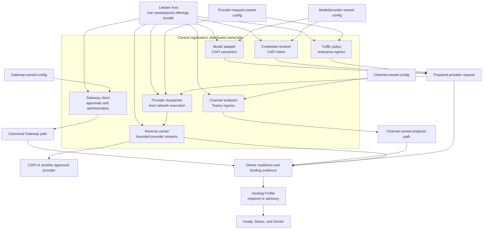

# Proposal: Hosted Integration and Capability Bindings

## Summary

Define two related hosted integration surfaces:

1. a **host integration plane** for wiring, governing, and observing canonical
   OpenClaw ingress and egress; and
2. capability-specific **host provider interfaces** for services that an
   isolated OpenClaw runtime explicitly consumes.

Define a namespaced **host integration bundle** that lets one hosting platform
register its implementations centrally while typed OpenClaw owner
configuration selects them at the correct semantic boundaries.

Reuse Hosting Profiles to make every selected attachment and capability
observable and to promote deployment-critical readiness criteria to required.

Define one optional provider-dispatch reverse carrier for the narrow case where
OpenClaw cannot reach an approved destination and the host must physically
execute the request. This proposal does not define ClawBus or a generic host
bus.

This proposal separates two contracts that serve different users:

```text
application or operator
  -> OpenClaw SDK
  -> OpenClawTransport
  -> Gateway requests and events

OpenClaw runtime
  -> capability-specific host interface
  -> local, process, sidecar, or hosted binding
  -> selected local or remote carrier
  -> host implementation
```

`OpenClawTransport` remains the public app SDK's minimal client-to-Gateway
`request()` and `events()` abstraction. It is not extended with reverse
callbacks, provider registration, Channel ingress, lifecycle control, or
AgentHarness streams.

The host integration plane uses existing canonical Gateway, Channel, provider
request, and lifecycle boundaries to connect OpenClaw to the outside world. It
can apply explicit routing, policy, monitoring, provenance, and bounded
transformations at those registered boundaries.

### Architecture at a glance



The design has four named parts:

- **Host attachments:** Gateway clients, Channel endpoints, and traffic policy
  attach at their canonical owner boundaries.
- **Runtime capabilities:** adapters, credential resolvers, dispatchers,
  secrets, publication, and telemetry remain independently typed services.
- **Registration and readiness:** the bundle registers offerings, owner
  configuration selects them, and Hosting Profiles aggregates owner evidence.
- **Connection choices:** each binding uses its native transport; only hosted
  provider dispatch requires the narrow reverse connection in V1.

### What V1 includes

Hosted integration has two main kinds of work. Host attachments define where a
host connects to OpenClaw-owned traffic and operations. Runtime capabilities
define explicit services that OpenClaw consumes from a selected binding.

#### Host attachments

| Attachment kind | What V1 standardizes | Canonical owner | Initial Lobster migration |
| --- | --- | --- | --- |
| Gateway client | Required methods/events/scopes, compatibility, identity, generation, readiness, status, and migration authority | Gateway | Exec approval presentation/resolution, pairing, observation, administration, suspend, restart, and lifecycle orchestration use canonical Gateway surfaces |
| Channel endpoint | Route identity, trusted-forwarder authentication, limits, acknowledgement classes, idempotency, generation, readiness, and status | Channel | Teams delivery and acknowledgement move from private frames to a Channel-owned endpoint |
| Traffic policy | Compiled deny/narrow/route decisions, proxy/TLS/private-route constraints, provenance, conflict behavior, and no-weaker-fallback | Provider request transport | Lobster enterprise egress policy compiles into the existing guarded provider-request path |

Host attachments share a common operational view:

- desired and effective implementation;
- semantic owner and interface version;
- authenticated principal;
- owner generation and binding incarnation;
- required or advisory readiness posture;
- configuration and policy provenance;
- authoritative, shadow, or disabled migration mode; and
- structured failure and reload disposition.

These attachments do **not** use one callback schema. Gateway clients continue
to use Gateway methods/events. Channel endpoints continue to use Channel-owned
payloads and acknowledgement rules. Traffic policy produces a compiled
decision rather than becoming a remote per-request policy RPC.

#### Runtime capabilities

| Capability family | What V1 standardizes | Canonical owner | Initial Lobster migration |
| --- | --- | --- | --- |
| Provider adapter | Provider-specific URL, query, bounded body preparation, non-secret headers, credential-slot declaration, and response interpretation | Model, Channel, web, or other provider owner | CAPI, Substrate, WebIQ, Anthropic, ACF, and Graph preparation move out of the private forwarding handler |
| Credential-slot resolver | Declared secret value, fixed placement, allowed origins, expiry/audience rules, redaction, and readiness | Credential or identity owner selected by the consuming owner | CAPI/Substrate tokens, API keys, Entra OBO, and agentic-user credentials become independently registered resolvers |
| Traffic/network policy | Intersection of OpenClaw semantic authority with host route restrictions | Provider request transport; shared with host traffic policy | `lobster/enterprise-egress` authorizes or narrows the prepared request |
| Provider-request dispatcher | One redirect-disabled HTTP exchange, physical DNS resolution, guard-profile enforcement, request/response streaming, cancellation, overload, and dispatch certainty | Provider request transport | ProxyPipe brokered provider egress moves to local or `lobster/egress` bindings |
| Secret provider | Existing SecretRef-compatible hosted binding when env/file/exec are insufficient | Secrets | `lobster/vault` is a later capability proof, not the first deletion-bearing slice |
| Publication provider | Durable publication after continuity defines checkpoint and receipt semantics | Runtime State Continuity | `lobster/workspace` remains blocked on the continuity contract |
| Telemetry provider | Export through a host-owned sink with portable failures and redaction | Telemetry | `lobster/telemetry` is registered independently from request dispatch |

Runtime capabilities do **not** absorb Gateway approvals, Channel ingress,
lifecycle, AgentHarness, arbitrary product services, or a universal
`{ interface, operation, payload }` host invocation API.

#### How traffic policy and dispatch connect

The provider path has one explicit handoff:

```text
model/Channel/web owner adapter
  prepares URL, body, non-secret headers, response policy, and credential slots
        |
        v
host traffic policy
  denies, narrows, or selects an authorized route
        |
        v
credential-slot resolver
  materializes only the declared secret value for allowed origins
        |
        v
provider-request dispatcher
  performs one guarded, redirect-disabled physical exchange
        |
        v
semantic owner
  handles redirects, retries, provider status, and response interpretation
```

No lower layer may widen authority granted above it. The effective request is
the intersection of owner semantics, owner configuration, credential grant,
traffic policy, network guard, and current generations.

Host provider interfaces describe **what capability OpenClaw consumes**.
Bindings describe **where and how the implementation runs**. A local OpenClaw
installation may use in-process, environment, file, executable, or direct
network bindings. A managed host may satisfy the same interface through a
generation-bound hosted binding.

The architecture does not require a bus, generic integration API, Gateway
replacement, or one physical connection. A later implementation may extract
shared carrier machinery after a second real capability proves the need, but
transport consolidation is not a V1 surface.

## Motivation

OpenClaw normally has direct access to its network, filesystem, process
environment, credentials, channels, and storage. Existing interfaces can be
implemented locally.

Managed hosts may deliberately isolate the runtime:

- outbound traffic must use enterprise routing and policy;
- credentials remain in a host-managed vault;
- durable state is published to host-managed storage;
- telemetry must include deployment and tenant context;
- inbound channel traffic enters through a host-controlled endpoint; and
- lifecycle actions must be fenced to the active runtime generation.

Lobster currently satisfies several such needs through ProxyPipe, a
reverse-dialed connection initiated by the container. Over time that physical
connection accumulated private definitions for egress, product services,
Teams delivery, lifecycle, approvals, runtime identity, and AgentHarness
traffic.

The problem is not that one connection carries multiple facilities. The
problem is that the pipe became the owner of their interfaces. A replacement
must not repeat that architecture under a new envelope.

## Two Problems

### Host integration and traffic governance

The host needs a supported way to wire OpenClaw to external systems:

- expose or proxy Gateway access;
- attach Channel ingress and outbound delivery adapters;
- apply egress proxy, TLS, identity, and network policy;
- observe and audit traffic at canonical boundaries;
- present and resolve approvals through a host operator client;
- bind routes to the active container generation; and
- report readiness and failure for each integration point.

This is primarily a composition and governance problem. The host acts as an
OpenClaw client, adapter, proxy, or policy boundary. `OpenClawTransport` is
appropriate when the host is acting as a Gateway client.

### Host capability provision

The isolated runtime may also need to call a service implemented by the host:

- resolve a secret;
- dispatch a governed provider request;
- publish durable state;
- emit telemetry through a host-owned sink; or
- acquire another explicitly declared capability.

This is a provider problem. The runtime consumes a capability-specific
interface and should not depend on the provider's location or carrier.

Both problems contribute to ProxyPipe removal. They must not be collapsed into
one method registry.

## Existing Boundaries

### OpenClaw app transport

The public SDK defines `OpenClawTransport` as:

```ts
type OpenClawTransport = {
  request<T>(
    method: string,
    params?: unknown,
    options?: GatewayRequestOptions,
  ): Promise<T>;
  events(filter?: (event: GatewayEvent) => boolean): AsyncIterable<GatewayEvent>;
  close?(): Promise<void> | void;
};
```

It allows the high-level SDK to use Gateway WebSocket, fake, embedded, or
future client transports without changing `OpenClaw`, `Agent`, `Run`, and
`Session` APIs. Its caller is an application or operator controlling and
observing OpenClaw.

This RFC preserves that direction and ownership.

### Runtime extension interfaces

OpenClaw already uses capability-specific extension patterns:

- SecretRefs select bounded `env`, `file`, or `exec` providers.
- Provider request policy separates auth, headers, proxy, TLS, SSRF, and
  guarded fetch behavior.
- Channel plugins expose distinct inbound, outbound, security, lifecycle,
  status, and acknowledgement adapters.
- AgentHarness plugins implement prepared execution attempts while core keeps
  provider, transcript, workspace, tool, and delivery policy.
- Gateway methods and events own approvals, pairing, status, and lifecycle
  administration.

These are the models to extend. A shared carrier is not a competing catalog.

## What Exists Today And What Is Missing

OpenClaw already has configuration and registries for many individual
subsystems. This RFC does not replace them with a new host configuration tree.

The gap is uneven: some hosted needs already have a canonical owner seam,
others have only part of one, and some currently exist only inside Lobster's
private forwarding path.

| Need | What OpenClaw already has | What is missing for a managed host |
| --- | --- | --- |
| Approvals and administration | Canonical Gateway methods, events, roles, scopes, and a native approval consumer | Supported external-host packaging, non-TypeScript schemas/fixtures, least-privilege identity guidance, and binding readiness/status |
| Teams ingress | Channel ownership and an existing HTTP delivery path | A typed endpoint attachment covering trusted forwarding, route identity, acknowledgement, idempotency, generation, and readiness |
| Provider traffic governance | Proxy, TLS, SSRF, guarded fetch, and provider-request policy | A host-contributed compiled policy with provenance, conflict handling, managed-private route grants, and no-weaker-fallback |
| Provider-specific preparation | Model/provider code prepares ordinary requests and interprets responses | Owner registration for CAPI/Substrate/WebIQ/Anthropic/Graph adaptations that currently live in Lobster forwarding code |
| Request credentials | SecretRef providers and ordinary static provider authentication | A request-scoped credential-slot resolver with fixed header placement, allowed origins, audience/expiry, and redaction |
| Physical provider dispatch | Guarded fetch performs the final network exchange locally | A replaceable one-hop dispatcher beneath the existing guard/redirect loop, with a local default and optional hosted binding |
| Hosted reverse topology | Gateway and node transports provide useful connection machinery | A least-privilege provider-only reverse stream with independent flow control, generation fencing, cancellation, and certainty |
| Hosted deployment readiness | Per-owner status plus Hosting Profiles | Owner criteria and one inventory joining desired IDs, resolved registrations, versions, provenance, generations, and failures |

This is why Lobster could not solve the problem by adding more ordinary config
references. A config value can select only an implementation type that its
semantic owner knows how to resolve, validate, activate, and invoke. Several of
those owner-owned registration and binding seams do not exist today.

ProxyPipe therefore became both:

- the physical route to the host; and
- the private place where missing provider adaptation, credentials, policy,
  correlation, streaming, acknowledgement, and operational behavior were
  implemented.

The RFC separates those concerns. Existing owner seams are reused. Missing
owner seams are added narrowly. The reverse connection is retained only for
the traffic that actually requires it.

## What The Bundle Adds

The host integration bundle does not create the capabilities above. Their
semantic owners and implementations do.

The bundle adds one packaging and validation boundary:

1. a host package declares the implementation IDs and interface versions it
   supplies;
2. the complete manifest is validated before any contribution becomes visible;
3. existing owner-specific config sections reference those IDs;
4. each owner resolves the reference through its own registry and validates
   compatibility;
5. unresolved, disabled, ambiguous, or incompatible references fail
   explicitly;
6. readiness, Status, and Doctor can connect the selected config path to the
   registered implementation and its current runtime evidence.

Without the bundle, each owner could still register a hosted implementation
independently, but operators would need to discover, install, version, inspect,
and diagnose those contributions separately. The bundle makes one host's
offerings coherent without making them one interface.

The bundle does **not**:

- define provider, Gateway, or Channel payloads;
- grant credential or network authority;
- activate every contribution in one transaction;
- route every operation through one carrier; or
- replace ordinary OpenClaw configuration.

Its practical value is that distributed owner configuration can safely point
to one validated set of host offerings:

```text
one installed host package
  -> many owner-specific registered implementations
  -> typed references from existing config sections
  -> owner-local validation and activation
  -> joined readiness, Status, and Doctor evidence
```

## Goals

- Define explicit host capability interfaces useful outside Lobster.
- Define a host integration plane from existing canonical adapter and Gateway
  boundaries.
- Let a host register one namespaced integration bundle while owner config
  selects typed implementations.
- Reuse Hosting Profiles for required/advisory readiness, admission, health,
  and status projection.
- Preserve the same consuming interface across local and hosted deployments.
- Allow implementations to be in-process, file/env/exec, loopback, sidecar, or
  remote.
- Add capability-specific hosted bindings only where local bindings are
  insufficient.
- Keep carrier selection replaceable and subordinate to bindings.
- Bind remote providers to deployment identity and active runtime generation.
- Give every interface independent schemas, permissions, bounds, failures,
  health, and conformance.
- Permit later carrier reuse without requiring a shared carrier catalog in V1.
- Reuse proven correlation and connection machinery where appropriate.
- Support TypeScript and non-TypeScript implementations with shared fixtures.
- Enable incremental downstream retirement of duplicate private bridge
  mechanics.

## Non-Goals

- Extending `OpenClawTransport` into a bidirectional host protocol.
- A new Gateway replacement or second application RPC protocol.
- A generic arbitrary method or event registry.
- Treating a host provider as a paired node or granting one generic host
  operator identity.
- Copying Gateway, Channel, lifecycle, continuity, or AgentHarness schemas into
  a carrier-owned union.
- Requiring a sidecar or remote host for ordinary local OpenClaw.
- Requiring one shared bus or connection.
- Moving transparent network interception into OpenClaw application semantics.
- Defining provider-specific enterprise backend implementation.
- Solving all ProxyPipe families in one migration.

## Model

### Host wiring model

OpenClaw should make hosted setup as easy as ProxyPipe without copying
ProxyPipe's central semantic envelope.

The model has four steps:

```text
host integration bundle registers implementations
  -> owner configuration selects typed implementation IDs
  -> owners validate, activate, and publish readiness evidence
  -> Hosting Profiles enforces the selected workload contract
```

The bundle centralizes packaging and discovery. It does not configure every
subsystem, construct arbitrary providers, accept callbacks, or define domain
payloads.

Owner configuration remains authoritative for detailed settings. Hosting
Profiles declares which resulting conditions are required; it does not select
or configure implementations.

### Host integration plane

The host integration plane is a composition of registered, canonical
boundaries rather than one new API:

| Integration point | Canonical owner |
| --- | --- |
| Gateway requests, events, approvals, and status | Gateway and `OpenClawTransport` |
| Message ingress | Channel-owned endpoints |
| Message outbound delivery | Channel adapters plus provider/network routing |
| Provider HTTP routing, TLS, proxy, and policy | Provider request transport |
| Lifecycle administration | Gateway lifecycle APIs |
| Runtime identity and readiness | Gateway handshake, status, and Hosting Profiles |
| Agent execution | AgentHarness |

OpenClaw should make these points discoverable, configurable, observable, and
conformable for hosts. A host policy hook may allow, deny, route, annotate, or
perform a schema-defined transformation only where the owning interface
explicitly permits it. There is no global "intercept every message" hook.

### V1 host attachment catalog

The host integration plane has three V1 attachment kinds:

1. **Gateway client** for canonical methods and events such as approvals,
   pairing, observation, configuration, Channel lifecycle, suspension, and
   restart administration.
2. **Channel endpoint** for host routing to a Channel-owned webhook,
   WebSocket, queue, polling endpoint, or owner-defined trusted-forwarder
   route.
3. **Traffic policy** for compiled destination, private-network, proxy, TLS,
   and route constraints attached to provider traffic.

These kinds share composition metadata, not one callback schema. Approval
payloads remain Gateway-owned, Channel payloads remain Channel-owned, and
provider request semantics remain provider-owner-owned.

A speculative remote Channel adapter is not a V1 attachment kind. OpenClaw
already owns in-process Channel adapter contracts, and the first Lobster Teams
migration can use a Channel endpoint attachment. A remote adapter requires a
concrete Channel that cannot use endpoint routing or ordinary outbound network
governance.

Every attachment descriptor declares:

- stable owner-defined ID, kind, and version;
- semantic owner and target;
- required methods, events, scopes, capabilities, routes, or references;
- authority and cardinality;
- permitted outcomes and transformations;
- authenticated identity and provenance requirements;
- lifecycle and readiness behavior;
- status source and redaction;
- migration authority; and
- references to owner-owned schemas.

The catalog is metadata-only. It does not contain arbitrary callbacks,
executable policy, payload unions, or carrier envelopes.

Descriptor evolution is additive. Unknown optional fields may be ignored.
Unknown required capabilities reject activation.

### Gateway client attachments

Gateway hello already advertises protocol version, methods, events,
capabilities, authenticated role/scopes, initial state, and payload limits.
Gateway method descriptors remain the canonical authorization and discovery
table.

Approval, pairing, observation, and administration normally use separate
least-privilege logical clients. They may share a network route or connection
pool only if independent authenticated principals, queues, and failure domains
remain intact.

### Channel endpoint attachments

The Channel owner declares:

- effective route and endpoint kind;
- provider-direct, trusted-forwarder, or local-only authentication;
- body and framing limits;
- idempotency source;
- acknowledgement and retry classification;
- readiness and reload behavior; and
- redaction.

Provider-direct authentication is preferred. Trusted forwarding is explicit,
mutually authenticated, pinned to a binding and generation, and validated
under Channel-owned rules. The composition layer treats the body as opaque.

At-least-once delivery is the default assumption. A Channel maps its protocol
response into `accepted`, `retryable`, `terminal`, or `unconfirmed`; the host
attachment layer does not infer one global meaning for every HTTP status.

### Traffic policy attachments

Traffic governance is evaluated after OpenClaw resolves provider semantics and
hard safety but before final dispatch:

```text
OpenClaw semantic request and hard safety
  -> effective OpenClaw provider policy
  -> host governance intersection
  -> selected dispatch binding
  -> provider response interpreted by semantic owner
```

V1 policy is compiled locally and receives redacted route metadata, not request
bodies or credential values. It may deny, narrow destinations, reduce timeout,
or select an approved route profile. It cannot weaken SSRF/TLS checks, replace
protected attribution, silently change provider semantics, or expand an
earlier policy.

Standard HTTP proxies and service-mesh egress gateways remain valid dispatch
paths. A host provider is required only when the host physically executes the
prepared request as an application capability.

### Common binding status

Prepared attachments expose:

- binding and attachment IDs;
- desired and effective state;
- required or optional posture;
- owner desired/observed generation and binding incarnation;
- authoritative, shadow, or disabled mode;
- authenticated principal summary;
- resolved references;
- configuration and policy provenance;
- owner-produced status conditions; and
- last transition and structured failure.

Shared conditions include `Accepted`, `ResolvedRefs`, `Authenticated`,
`Compiled`, `Listening`, `Programmed`, `Ready`, and `Degraded`. Not every
attachment uses every condition. Status is current only when its observed
generation matches the owner's desired generation.

Hosting Profiles and status aggregate owner truth; they do not accept
host-written success that overrides Gateway, Channel, or provider-policy
health.

### Host integration bundle

A hosting platform may register one namespaced bundle that declares the
implementations it can supply across independently owned OpenClaw contracts.

Illustrative shape:

```jsonc
{
  "id": "lobster-host",
  "version": "1.0.0",
  "contracts": {
    "channelEndpoints": ["lobster/teams"],
    "trafficPolicies": ["lobster/enterprise-egress"],
    "modelProviderAdapters": [
      "lobster/anthropic-direct",
      "lobster/capi",
      "lobster/substrate-llmapi"
    ],
    "credentialSlotResolvers": [
      "lobster/anthropic-key",
      "lobster/capi-token",
      "lobster/substrate-token"
    ],
    "providerRequestDispatchers": ["lobster/egress"],
    "secretProviders": ["lobster/vault"],
    "publicationProviders": ["lobster/workspace"],
    "telemetryProviders": ["lobster/telemetry"],
    "carriers": ["lobster/reverse-provider"]
  }
}
```

Names and exact manifest syntax are provisional. Existing plugin package and
capability-provider registration should be reused. Missing contract types add
owner-specific registry contributions; they do not add a universal host
provider registry or generic invoke API.

Provider adapters register with their semantic owner. CAPI and Substrate are
model-provider contributions; Channel or web adaptations use their own owner
registries. There is no universal provider-adapter registry.

The bundle manifest is validated as one immutable registration snapshot before
its contributions become visible. Owner activation remains independent.

Owner config selects the registered IDs:

```jsonc
{
  "channels": {
    "msteams": {
      "endpoint": "lobster/teams"
    }
  },
  "providerRequests": {
    "trafficPolicy": "lobster/enterprise-egress",
    "dispatcher": "lobster/egress"
  },
  "models": {
    "providers": {
      "capi": {
        "requestAdapter": "lobster/capi",
        "credentials": {
          "primary": "lobster/capi-token"
        }
      }
    }
  },
  "secrets": {
    "provider": "lobster/vault"
  },
  "hosting": {
    "profile": "lobster/managed"
  }
}
```

This syntax is illustrative. The normative rule is that distributed fields are
typed references to central registrations, not repeated host implementation
definitions.

The resulting provider path is assembled from independently typed
contributions:

```text
provider owner adapter
  -> declared credential slot resolver
  -> provider-request policy
  -> provider-request dispatcher
```

The adapter owns provider-specific URL, body, non-secret header, and response
semantics. The credential resolver supplies only the declared secret value.
The dispatcher owns only physical resolution and network execution.

Credential use is the intersection of adapter declaration, owner
configuration, resolver-declared placement/origins, and traffic/network
policy. Naming a slot does not grant access to it.

The bundle does not make Lobster the owner of Teams, provider requests,
secrets, publication, telemetry, or Gateway. It packages Lobster
implementations of contracts owned by those subsystems.

Configuration references to missing, disabled, ambiguous, or incompatible
bundle registrations fail explicitly. A configured governed binding never
silently falls back to a less-governed direct implementation.

### Capability interface

A host provider interface is owned by the OpenClaw subsystem that consumes it.
It defines:

- stable interface and operation identifiers;
- typed request, result, and failure schemas;
- required and optional capabilities;
- permissions and subject context;
- semantic payload bounds;
- idempotency and replay behavior;
- redaction and domain audit semantics; and
- conformance fixtures independent from any carrier.

Illustrative interfaces include:

```text
secrets.resolve.v1
provider-request.dispatch.v1
publication.commit.v1
telemetry.export.v1
```

These names are provisional. Interfaces should extend existing OpenClaw seams
rather than introduce a parallel host namespace when a suitable contract
already exists.

Channels, approvals, AgentHarness, and lifecycle remain their existing
interfaces. They may gain hosted bindings, but they are not reclassified as
generic host providers.

### Binding

A binding implements a capability interface in a particular environment:

```text
in-process plugin
environment or mounted file
bounded executable
loopback socket
local sidecar
capability-specific hosted binding
```

The consuming OpenClaw subsystem does not change because a deployment chooses
a different binding.

Bindings may expose additional operational metadata such as provider instance,
endpoint, connection state, owner generation, and host bundle generation. That
metadata must not leak into the semantic interface unless it changes portable
behavior.

A hosted binding is specific to one capability interface and version. It is
not a universal `{ interface, operation, payload }` invocation API.

### Provider-dispatch reverse carrier

V1 defines no generic carrier catalog. Gateway clients use Gateway, Channel
endpoints use their declared endpoint transport, traffic policy commonly uses
an HTTP proxy or service mesh, and local capabilities continue to use their
native bindings.

One optional reverse carrier is defined for provider-request dispatch when:

- OpenClaw cannot directly reach the approved destination;
- a standard proxy or service mesh is insufficient; and
- the host must physically execute the prepared request.

```text
host dispatcher opens authenticated provider-dispatch session
  -> OpenClaw admits binding ID, interface version, and generation
  <- OpenClaw sends prepared dispatch operations and body credit
  -> host returns response streams or structured dispatch failures
```

The recommended first realization is a dedicated least-privilege host-provider
session that reuses Gateway challenge, identity, limits, correlation, and peer
invocation machinery where practical. Provider bodies use independent queues
and scheduling from operator Gateway traffic.

The carrier supports bounded bidirectional streams, request/response credit,
half-close, cancellation, one terminal result, connection-incarnation
tracking, and generation fencing. It does not interpret provider status codes,
redirects, retries, credentials, or bodies.

Transport failure distinguishes at least:

```text
not-started
started-unconfirmed
response-started
completed
```

V1 does not replay or resume requests after reconnect. OpenClaw owns any
semantic retry decision.

Existing `node.invoke` wire behavior remains unchanged. Shared internal pending
call or peer-session machinery may be extracted, but a host is not represented
as a node or operator.

A shared multipurpose carrier may be proposed later only after a second
capability demonstrates duplicated connection cost that outweighs failure,
flow-control, security, and release coupling.

## Binding Selection And Activation

For each attachment or capability, its owning config selects at most one
effective implementation for the applicable scope.

1. A host bundle registers implementations and interface versions.
2. Owner config references one registered ID.
3. The owner validates configuration, policy, compatibility, and authority.
4. The owner activates its binding and publishes trusted readiness evidence.
5. Hosting Profiles classifies the criterion as required or advisory.
6. Required criteria must all be `True` before hosted traffic is admitted.
7. A same-generation reconnect may restore one binding incarnation but does
   not replay in-flight work.
8. A newer owner generation supersedes the old binding and rejects stale
   results.
9. Remote failure never silently falls back to a less-governed local binding.

During migration, dual-stack operation is explicit observation or comparison,
not implicit fallback. It declares a primary, a shadow or compatibility path,
mismatch telemetry, an expiry release, and the exact removal gate.

There is no cross-owner distributed activation transaction:

```text
prepare
  -> activate dependencies
  -> observe owner readiness
  -> publish owner evidence
  -> Hosting Profiles adjudicates readiness
  -> compensate or remain non-ready on failure
```

Owners fence their own side effects and generations. Hosting Profiles observes
the result; it does not construct providers or perform activation.

## Identity And Authorization

A remote provider binding must prove:

- issuer and deployment audience;
- provider instance or public-key identity;
- allowed interfaces, versions, and operations;
- tenant/runtime binding when applicable;
- active owner binding generation and host bundle generation;
- issued-at, expiry, and credential identifier; and
- possession of the matching private key or equivalent secret.

Provider permissions are distinct from operator scopes and node pairing.
Unknown interfaces, versions, operations, and generations fail closed.

Effective authority is:

```text
declared by provider
  intersect credential grants
  intersect configured host requirements
  intersect protocol-version support
```

An active connection may narrow but not expand its admitted authority.

A host dispatcher that physically executes a prepared provider request may
observe credentials in protected headers. That data-plane exposure does not
grant authority to resolve, mint, widen, or reuse secret references.
Credentials should be scoped and short-lived where possible and must be
redacted from logs, status, failures, and audit payloads.

## Generation Fencing

Every remote route and pending operation records connection identity plus two
generations:

- the **owner binding generation**, which identifies the authoritative owner
  configuration; and
- the **host bundle generation**, which identifies the admitted host deployment
  and implementation set.

A newer owner generation supersedes the older binding before side effects. A
newer host bundle generation requires re-admission and a new carrier
incarnation, but does not advance owner configuration. Remote operations carry
both generations; stale pending operations fail with a stable stale-route
result, and late completions for either generation are ignored and audited.

Local bindings may use process lifetime as their generation. Managed hosts may
use a deployment revision or lease. The portable contract does not require a
particular host database or controller.

## Failure And Overload

Each capability interface defines domain schemas, domain failures, semantic
authorization, and idempotency. A binding profile defines availability,
readiness, and resource limits. A remote carrier may add transport failures
such as:

```text
ProviderUnavailable
ProviderOverloaded
ProviderTimedOut
ProviderStale
ProviderRouteChanged
InvalidProviderResult
```

Each hosted binding has maximum in-flight operations, request/result byte
limits, and a bounded queue policy. Saturating one interface must not block
Gateway control traffic or another provider binding.

Timeout does not imply that remote work stopped. The unary foundation does not
claim cancellation. The provider-dispatch reverse carrier adds advisory
cancellation only; dispatch-certainty state, not a cancellation
acknowledgement, determines whether retry can be safe.

Retry remains the consuming interface's decision and is allowed only for
operations declared idempotent.

## Ingress, Egress, And Interception

Three concepts must remain distinct:

1. **Transparent host mediation** observes or constrains network traffic around
   the container. Proxies, firewalls, service meshes, and policy engines own
   this layer.
2. **Ingress adapters** translate external activity into a canonical OpenClaw
   interface such as a Channel.
3. **Host providers** are explicit capabilities invoked by OpenClaw, such as a
   secret resolver or governed provider-request dispatcher.

Transparent mediation does not require a host-provider operation. An ingress
adapter does not become a generic host callback. An explicit provider call
must not silently intercept unrelated Gateway or Channel traffic.

## Evidence Slices And First Vertical Milestone

The two problems require separate evidence slices.

### Traffic-plane slice

Move exec approval presentation and resolution from ProxyPipe tags 29-30 to a
dedicated, least-privilege host operator connection using canonical Gateway
events and methods through `OpenClawTransport`.

This proves hosted wiring, identity, policy, monitoring, generation ownership,
and mixed-version migration without inventing a provider interface.

OpenClaw already contains the reference approval consumer behavior in its
native Channel approval runtime: least-privilege connection, pending replay,
live-event deduplication, expiry, reconnect, and resolved-event finalization.
The product gap is supported packaging, non-TypeScript schemas and
conformance, composition status, and hosted identity guidance rather than a
new approval protocol.

### Channel endpoint slice

Move Teams activity delivery and acknowledgement from ProxyPipe tags 12-13 to
a Channel endpoint attachment over the existing pod-locality-independent HTTP
route.

The slice proves:

- pinned tenant/user/runtime route identity;
- owner-defined trusted-forwarder authentication;
- stable delivery ID and duplicate acceptance;
- accepted, retryable, terminal, and unconfirmed outcomes;
- endpoint generation and readiness; and
- fixture/probe shadow validation without duplicating live actionable events.

It makes the pipe-local delivery waiter and acknowledgement routing redundant
downstream without introducing `channel.ingress`.

### Traffic policy slice

Compile one host provider-egress policy into the existing provider request
policy and guarded-fetch path.

The slice proves:

- destination denial;
- approved route-profile selection;
- conflicting policy activation failure;
- no implicit governed-to-direct fallback; and
- policy generation and decision provenance.

This slice proves the traffic-policy-to-dispatch boundary. It does not migrate
the streamed downstream provider-request path.

### Capability-provider slice

Add a hosted provider-request dispatcher beneath the existing provider request
policy and guarded-fetch layers:

- register provider-specific adapters with their semantic owners and register
  credential-slot resolvers separately from the dispatcher;
- let model, Channel, or provider owners select adapters that prepare
  provider-specific URL/body/non-secret headers and response handling;
- keep auth, redirect handling, cross-origin header rewriting, TLS/SSRF policy,
  semantic retry, and response interpretation in OpenClaw;
- replace only one redirect-disabled network exchange inside the guarded-fetch
  loop;
- require the selected dispatcher to enforce OpenClaw's versioned network guard
  profile where physical DNS resolution and connection occur;
- preserve a local direct-network binding;
- define request/response streaming, replayability, bounds, cancellation, and
  dispatch certainty before claiming full HTTP parity;
- permit host-only private destinations only through explicitly authorized
  origins/CIDRs in the selected binding profile;
- use declared origin-scoped header credential slots rather than arbitrary host
  mutation; and
- enable downstream egress migration after equivalent bounded and streamed
  behavior is proven for the same guard profile.

Hosted secret resolution remains a useful second provider binding, but it does
not currently migrate a private bridge path and therefore is not the first
adoption-bearing slice.

Selection criteria for later providers:

- useful outside Lobster;
- same interface supports a local binding;
- no change to `OpenClawTransport`;
- no copied Gateway or Channel schema;
- meaningful downstream simplification; and
- reusable TypeScript and Rust conformance.

### Full CAPI vertical milestone

The first implementation milestone combines the preceding contracts into one
production-shaped CAPI proof:

```text
lobster-host bundle registration
  -> model owner selects lobster/capi
  -> model owner selects lobster/capi-token
  -> provider request applies lobster/enterprise-egress
  -> lobster/egress dispatches through the reverse carrier
  -> CAPI streaming response returns through OpenClaw-owned semantics
  -> Hosting Profile, Status, and Doctor expose the assembled binding
```

The milestone is not complete after a provider-neutral fixture, registry-only
demonstration, or simple key-based provider. It must prove:

- local and hosted CAPI conformance;
- URL, query, body, non-secret header, and streamed response adaptation;
- origin-scoped host token acquisition;
- public and explicitly authorized managed-private routes;
- redirect-disabled one-hop dispatch and per-hop guard evaluation;
- bounded request and response streaming;
- overload, cancellation, stale generation, and dispatch certainty;
- no reconnect replay;
- owner readiness and `Degraded` capacity reporting;
- unresolved-reference Doctor findings; and
- authoritative canary selection with explicit rollback.

Exec approvals and Teams remain separate host-attachment adoption tracks. They
register in later immutable versions of the same `lobster-host` bundle and use
the same owner-selection, readiness, Hosting Profile, Status, Doctor,
authority, and rollback model.

## Host Status And Readiness

This RFC reuses Hosting Profiles rather than introducing a second readiness
system.

Every selected host attachment and runtime capability publishes trusted,
owner-defined readiness evidence. Criteria are advisory by default. A built-in
or additive namespaced Hosting Profile promotes the criteria required for that
deployment.

```jsonc
{
  "hosting": {
    "profile": "lobster/managed",
    "profiles": {
      "lobster/managed": {
        "extends": "reverse-proxy",
        "requiredCriteria": [
          "channel.msteams.endpoint",
          "provider.request.policy",
          "provider.request.dispatcher"
        ],
        "advisoryCriteria": [
          "telemetry.lobster"
        ]
      }
    }
  }
}
```

The profile declares required outcomes. It does not duplicate Channel,
provider-request, secret, publication, or telemetry configuration.

Readiness has two related evidence levels:

1. **bundle evidence**: the host bundle is loaded, compatible, authenticated,
   connected where needed, and current; and
2. **owner binding evidence**: the owner config references the implementation
   correctly and the resulting binding is usable.

Hosting Profiles should normally require the end-to-end owner condition. Bundle
conditions remain useful shared root-cause evidence.

Readiness is a fast, bounded, non-mutating admission decision. Status exposes a
richer structured inventory:

```text
host integration bundle and version
semantic owner
attachment or interface/version
desired and resolved implementation ID
carrier
provider instance
owner generation and binding/carrier incarnation
required/optional
desired/effective/observed state
structured conditions
limits and in-flight state
last transition
configuration and policy provenance
migration authority
```

Doctor consumes the same owner facts to produce detailed findings for
unresolved references, disabled registrations, incompatible versions, missing
credentials, policy conflicts, and stale or repeatedly reconnecting bindings.
Readiness messages remain concise and safely redacted; Doctor may point to
specific config paths and suggested repairs.

## Conformance

Shared fixtures must prove:

- interface schema and version validation;
- local and hosted semantic equivalence;
- permission and subject derivation;
- credential audience, expiry, and proof of possession;
- generation supersession and stale-result rejection;
- correlation and payload validation;
- deadline, disconnect, overload, and late-result behavior;
- idempotency-key behavior where declared;
- redaction and audit output;
- independent queue isolation; and
- compatibility with a non-TypeScript provider implementation.

Host attachment conformance additionally proves:

- approval replay/live dedupe, expiry, idempotent retry, and conflicting
  resolution rejection;
- Channel endpoint authentication, owner identity, duplicate delivery,
  acknowledgement classification, and unconfirmed timeout behavior;
- provider traffic deny, route selection, conflict, and no-weaker-fallback;
- stale owner generations cannot become authoritative;
- desired, effective, and observed status remain distinguishable; and
- side-effecting flows carry binding ID, owner generation, owner operation ID,
  and host audit correlation.

Bundle and Hosting Profiles conformance additionally proves:

- one central registration can supply several independently owned contracts;
- owner config references resolve only compatible registered implementations;
- missing or disabled registrations fail explicitly;
- owner criteria are advisory unless a named profile requires them;
- absent, stale, or `Unknown` required criteria keep the workload non-ready;
- bundle readiness cannot override failed owner binding readiness;
- readiness, status, and Doctor derive from consistent owner evidence; and
- disabling the bundle makes every referenced binding unavailable without
  direct fallback.

Transport conformance alone is insufficient. The same interface-level accepted
result and structured failure must pass against every supported binding.

## ProxyPipe Migration

Every ProxyPipe frame family first maps to its canonical owner:

| ProxyPipe family | Canonical target |
| --- | --- |
| Brokered provider egress | Provider request transport/dispatcher binding |
| Secret lookup, if added | Existing SecretRef provider interface |
| Teams ingress and acknowledgement | Channel endpoint attachment |
| Approvals and pairing | Existing Gateway methods and events |
| AgentHarness frames | AgentHarness protocol and binding |
| Lifecycle control | Gateway lifecycle plus continuity contracts |
| Publication | Runtime State Continuity publication interface |
| Product services | Owning plugin or Lobster product API |

A ProxyPipe adapter may temporarily carry several of these bindings over one
connection. It must not expose its private frame union as the canonical
interface.

The target Lobster integration is one centrally registered bundle containing
typed implementation contributions, not one centrally dispatched protocol.

Downstream compatibility may be retired after:

- its replacement interface and binding pass shared conformance;
- generation rollover, timeout, overload, disconnect, and mixed-version tests
  pass;
- the minimum supported OpenClaw release is declared;
- old-path telemetry shows no required traffic; and
- the fallback reaches its explicit expiry.

## Implementation Sequence

| Wave | Outcome |
| --- | --- |
| 0 | Accept the contract and Hosting Profiles prerequisites |
| 1 | Add the local dispatcher seam while approvals, Teams, and traffic-policy work proceed in parallel |
| 2 | Add the network guard profile, credential resolver, and CAPI model adapter |
| 3 | Add immutable bundle inventory, owner readiness, Status, Doctor, and the reverse-session endpoint |
| 4 | Prove the complete CAPI vertical through the Lobster bundle |
| 5 | Adopt Substrate, simple-key providers, Channel, Graph, approvals, and Teams through their semantic owners |
| 6 | Complete canary rollout and retire downstream compatibility after expiry |

The first proof milestone spans Waves 1-4. The foundational changes remain
independently useful OpenClaw factorings, but implementation does not stop
before the full CAPI vertical passes.

Within those waves:

1. define `provider-request-dispatcher/v1` at the existing redirect-disabled
   exchange and preserve direct local dispatch as the default;
2. export the fixed network guard profile and local/hosted conformance
   fixtures;
3. add origin-scoped credential-slot resolution and the CAPI owner adapter;
4. register one atomically valid `lobster-host` snapshot;
5. project bundle, owner, policy, dispatcher, carrier, generation, and
   migration evidence through Hosting Profiles, Status, and Doctor;
6. implement the provider-dispatch-only reverse carrier with bounded streams,
   independent flow control, generation fencing, and dispatch certainty;
7. run the complete local and hosted CAPI proof with traffic-policy
   intersection, canary authority, and rollback;
8. add approvals and Teams to later versioned bundle snapshots while retaining
   their canonical Gateway and Channel paths;
9. migrate remaining providers only after the CAPI proof; and
10. retire each downstream compatibility family only after parity, telemetry,
    rollback, and mixed-version expiry gates pass.

A shared carrier may be proposed later only if a second capability proves that
it removes more complexity than it adds.

## Rationale

### Why not extend `OpenClawTransport`?

It exists so applications can control and observe OpenClaw through Gateway.
Runtime host capabilities have different callers, lifecycle, permissions, and
failure semantics. Combining them would make one interface serve both sides of
the isolation boundary.

### Why not make Gateway the provider registry?

Gateway may be a useful carrier, especially where a reverse connection already
exists. Carrier reuse does not prove semantic ownership. Local and sidecar
bindings must remain possible without implementing Gateway.

### Why not define one generic host API?

Secrets, egress, publication, telemetry, Channels, and AgentHarness have
different authority, bounds, lifecycle, and conformance. A generic method
registry recreates ProxyPipe's central ownership problem.

### Why does OpenClaw still need host integration support?

Hosts otherwise rediscover where to attach Gateway clients, Channel endpoints,
provider network policy, lifecycle control, identity, readiness, and audit.
OpenClaw should publish and conform those integration points even though they
remain separately owned.

### Why not keep one physical connection?

Current evidence does not justify a multipurpose V1 connection. Approvals use
Gateway, Teams ingress uses a Channel endpoint, and traffic policy often uses a
proxy or service mesh. Only hosted provider dispatch clearly requires a reverse
stream when direct networking is unavailable.

The first reverse carrier is therefore provider-dispatch-specific. Shared
carrier extraction remains possible after a second capability demonstrates
real duplicated operational cost.

### Where should the ease of ProxyPipe survive?

In one centrally registered host integration bundle, typed references from
owner config, one named Hosting Profile contract, and one effective
readiness/status/Doctor view. It should not survive as one private semantic
envelope or global activation transaction.

## Unresolved Questions

- Which existing plugin manifest and registry surfaces can carry the host
  integration bundle, and which owner-specific contribution types are missing?
- Should the provider-dispatch reverse session reuse the Gateway WebSocket
  protocol, a dedicated subprotocol on the Gateway listener, or another
  bounded stream?
- What exact fixed-shape network guard profile should be public and versioned?
- Which existing owner registries should receive the first provider-adapter and
  credential-slot-resolver contributions?
- Which binding details belong in status while readiness remains a compact
  admission decision?
- Which transport audit fields are stable public contract?
- Which downstream compatibility code and tests become redundant after the
  first adoption slice?
