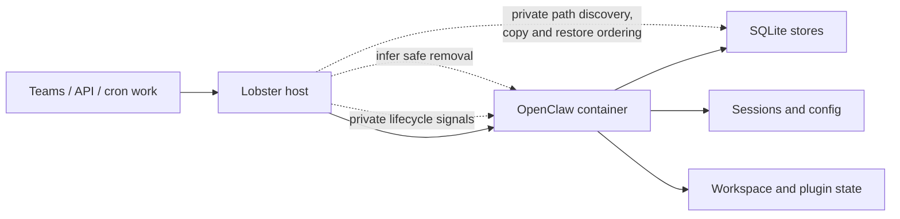
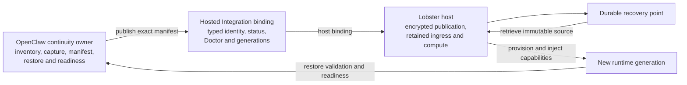
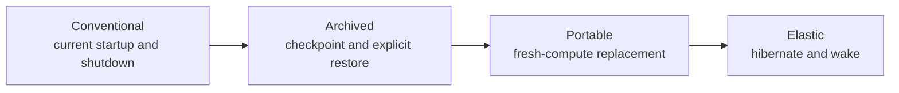

# Proposal: Runtime State Continuity

## Summary

Define the portable contract that allows a host to remove all OpenClaw compute
and later recreate the same logical runtime on fresh compute. The contract
combines online recovery points, a one-way drain-to-exit hibernation handoff,
durable wake intent, exclusive generation authority, ordered restore, and
restore-gated readiness.

OpenClaw and its state owners remain authoritative for state meaning, native
capture semantics, cron semantics, and restore validation. The host remains
authoritative for idle and cost policy, encrypted artifact storage, retention,
placement, wake timing, and durable ingress while compute is absent.

The first Lobster profile targets durable Teams ingress, cron deadlines, and
host/API requests. The portable contract is capability-based so other hosts and
channels can adopt different policies and mechanisms while preserving the same
observable guarantees.

This RFC follows the Hosted Integration and Capability Bindings proposal. It
reuses that proposal's host integration bundle, typed owner references,
owner-local activation, Hosting Profiles readiness, Status and Doctor
projection, generation fencing patterns, and capability-specific carriers.
Continuity owns checkpoint, publication, restore, hibernate, and wake semantics;
it does not define another host wiring framework.

## Motivation

Container and managed hosts need more than readiness:

```text
readiness: may this runtime receive work?
continuity: what acknowledged state can survive replacement?
```

A host can stop traffic and terminate a process, but that does not prove that
sessions, transcripts, memory databases, plugin state, pairing state, or
workspace changes are consistent and recoverable elsewhere. A local SQLite
snapshot may be complete without having been uploaded to host storage. A
previously successful checkpoint may be stale if a later mutation was
acknowledged.

Without an upstream contract, hosts infer safe shutdown from filesystem
activity, copy directories opportunistically, add private lifecycle signals,
or claim durability based on local artifact creation. Those approaches create
data-loss races and couple deployment logic to OpenClaw's current paths and
writers.

### The problem observed in Lobster

Lobster is trying to make OpenClaw inexpensive when idle and recoverable when a
container disappears. It already owns useful host capabilities:

- a durable Teams inbox that can retain work outside the container;
- external cron wake scheduling;
- container provisioning, placement, and generation fencing;
- encrypted host storage and retention; and
- runtime injection of Graph, proxy/session, and provider credentials.

The missing piece is an OpenClaw-owned recovery contract. Lobster currently has
to understand private paths and ordering, attempt workspace commit or copy
operations, coordinate through private lifecycle signals, and decide when a
container appears safe to remove. Those mechanisms cannot authoritatively say:

- which OpenClaw state surfaces are required;
- whether an online capture is internally valid;
- which artifact set was accepted as one recovery point;
- whether a new OpenClaw version can restore it;
- whether runtime-owned identity can move without copying host credentials; or
- when restored OpenClaw and its scheduler are ready for retained work.



This is fragile in both directions. Lobster becomes coupled to OpenClaw
internals, while OpenClaw cannot describe or test the recovery guarantee that a
host advertises on its behalf.

### Why Lobster cannot provide the guarantee from outside

This is an authority problem, not a preference for where code lives. A host can
observe files, processes, and lifecycle signals, but it cannot authoritatively
derive OpenClaw semantics from them:

| Required fact | Why Lobster cannot infer it safely | Required OpenClaw primitive |
| --- | --- | --- |
| Complete recovery state | Paths do not say which databases, files, plugin state, identity, or reconstructed data are required for this release. | Enumerable state-surface inventory and treatment. |
| Valid recovery point | Filesystem quietness does not prove SQLite, sessions, workspaces, and other owners each produced a valid capture. | Owner-native capture and one exact manifest. |
| Safe final handoff | Process exit does not prove all acknowledged work drained, writable owners stopped, or shutdown warnings preserved the handoff guarantee. | Admission closure, blockers, clean-shutdown result, and final closed-state capture contract. |
| Compatible restore | A host cannot know OpenClaw schema, plugin, identity, dependency, and restore-order rules by inspecting artifacts. | Versioned compatibility and ordered restore validation. |
| Ready restored runtime | A running process does not prove restore, dependency resolution, generation fencing, and cron reconciliation completed. | Restore-gated OpenClaw readiness and status. |

For Lobster to simulate these facts, it must maintain a shadow model of
OpenClaw's stores, writers, shutdown sequence, schemas, and startup ordering.
That model will either miss state and risk silent loss, or freeze OpenClaw
internals because every change becomes a host compatibility event. More private
Lobster coordination cannot close this gap; it only makes the duplicate model
larger.

The smallest correct boundary is for OpenClaw to commit to the semantic
primitives and for Lobster to consume them. That does not move storage,
placement, credentials, or compute policy into OpenClaw. It places each claim
with the only owner that can prove it.

### The proposed ownership boundary

OpenClaw should define the continuity levels because only OpenClaw and its
state owners know state meaning, native capture rules, restore ordering,
compatibility, scheduler reconciliation, and readiness. Lobster should
implement the host capabilities because it owns durable storage, encryption,
credentials, retained ingress, placement, and compute lifecycle.



The CAPE levels make that shared contract useful beyond Lobster:



Each level adds a measurable guarantee. A local user can remain Conventional or
use local Archived recovery without a managed host. Lobster can implement
Portable and Elastic by satisfying the same OpenClaw contracts rather than
maintaining a private recovery protocol. Other hosts can provide different
storage and wake mechanisms without teaching OpenClaw their backend details.

OpenClaw already has important pieces:

- `gateway.suspend.prepare/status/resume` can stop root work admission, report
  blockers, and issue a leased suspension;
- safe restart and shutdown events exist;
- snapshot work defines SQLite-consistent artifact creation, manifests,
  integrity verification, and restore semantics.

The missing contract composes those pieces into host-visible answers to:

> What state does OpenClaw own, through which state point is this runtime
> recoverable, can that state be restored compatibly elsewhere, and may the
> host now destroy this generation?

OCC can use the same contract to move or replace cells while remaining outside
the hot-path agent traffic and host storage implementation.

## Goals

- Recover the same logical runtime after all prior runtime processes and local
  ephemeral compute have disappeared.
- Inventory and classify existing OpenClaw state surfaces without changing
  their canonical stores, formats, or write paths.
- Produce recurring online recovery points without a runtime-wide pause.
- Support a host-proposed, one-way drain-to-exit handoff for planned
  hibernation.
- Bind each resumable recovery point to its earliest semantic wake deadline.
- Retain wake-triggering work outside absent compute and deliver it only after
  restore-gated readiness.
- Distinguish owner-produced capture/materialization from host publication.
- Fence active generations, final publication, and restored admission.
- Define restore ordering, compatibility, and failure semantics.
- Allow hosts to provide storage and publication without making OpenClaw know a
  specific backend.
- Make planned hibernation add no loss beyond a successful conventional clean
  shutdown, and make forced termination recoverable through a host-declared,
  visible RPO.
- Expose canonical continuity status suitable for Docker, Kubernetes, systemd,
  managed hosts, and OCC.
- Provide release conformance for checkpoint, sleep, wake, restore, fencing,
  and retained-delivery races.
- Reuse Hosted Integration registration, selection, readiness, status, Doctor,
  generation, and carrier conventions.

## Non-Goals

- Replacing readiness or Hosting Profiles.
- Replacing or redesigning OpenClaw's canonical state stores, schemas, writer
  APIs, transaction boundaries, or acknowledgement semantics.
- Making remote checkpoint storage canonical runtime storage.
- Requiring every deployment to use remote durable storage.
- Claiming scale-from-zero support for channels whose ingress requires a
  resident OpenClaw process.
- Mandating one checkpoint cadence, retention duration, cold-start lead time,
  or lease TTL across hosts.
- Standardizing a particular object store, filesystem, git, Graph, or database.
- Treating caches or reconstructable data as mandatory checkpoint state.
- Pausing the whole runtime for recurring recovery points.
- A distributed transaction across OpenClaw and host storage.
- Making OCC carry state artifacts or runtime event traffic.
- Expanding the snapshot proposal into a global storage coordinator.
- Introducing a global mutation generation or changing writer participation.
- Guaranteeing zero loss after forced termination beyond the last durable
  checkpoint.
- A continuity-specific host bundle, binding configuration tree, readiness
  system, generic host method registry, or carrier.

## Dependency on Hosted Integration

Hosted Integration is an architectural and implementation prerequisite for
hosted continuity bindings.

RFC 0020 owns:

- one immutable namespaced host integration bundle registration;
- typed implementation references in semantic-owner configuration;
- owner-local validation, activation, generation, and readiness evidence;
- Hosting Profiles required/advisory composition;
- shared Status and Doctor conventions;
- capability binding identity, authorization, overload, and failure patterns;
  and
- native or capability-specific carrier selection without a generic host bus.

This RFC owns:

- checkpoint and recovery-point semantics;
- the continuity-owned publication capability interface;
- recovery manifests, receipts, lineage, retention, and restore semantics;
- clean shutdown, final handoff, hibernate, wake, and restored-startup
  semantics;
- the lifecycle-owner restore-hold transition that fences launcher admission
  while original paths are claimed and assembled;
- CAPE guarantees and continuity policy;
- continuity-specific readiness evidence and conformance; and
- the requirements an existing Channel, secret, workspace, identity, or
  lifecycle binding must satisfy for Portable or Elastic operation.

The ownership composition is:

```text
host bundle registers continuity-related implementations
  -> continuity config selects typed publication binding and CAPE policy
  -> continuity owner validates and activates its binding
  -> existing Channel/secret/workspace owners activate their own bindings
  -> each owner publishes trusted readiness evidence
  -> Hosting Profile requires the deployment's end-to-end criteria
  -> Status and Doctor expose the assembled result
```

There is no global continuity activation transaction. Owners remain
independent, and readiness fails closed until every criterion required by the
selected Hosting Profile is `True`.

## Design decision record

These decisions record the questions that shaped the proposal, including the
alternatives considered for V1. They do not all have the same force:

- **Core invariant** is required for a portable safety or continuity claim.
- **Profile policy** is selected for the first Lobster profile but remains
  host-configurable when the resulting guarantee is explicit.
- **Implementation hypothesis** is the simplest source-backed shape to test,
  not a frozen API or mechanism.
- **Initial scope** identifies the first conformance target rather than a
  permanent product boundary.

All decisions are revisitable. A core invariant should change only when its
listed reopening evidence appears. Profile policy and implementation hypotheses
may change without revising the portable contract as long as the same
invariants and observable guarantees hold.

### Product and scope

| Question | V1 decision | Why | Reopen when |
| --- | --- | --- | --- |
| What is the user-facing objective? | **Core invariant:** recoverable **scale from zero** recreates the same logical runtime on fresh compute after all runtime processes have gone away. State continuity is the enabling contract; scale to zero is the cost optimization. | Backup or safe shutdown alone does not ensure that a message, user request, or cron deadline can recreate a usable runtime. | Another product contract owns end-to-end wake, restore, and delivery. |
| How do users adopt continuity without taking on the whole lifecycle? | **Core product model:** expose the independent continuity features through the monotonic operator-facing **CAPE** levels: `Conventional`, `Archived`, `Portable`, and `Elastic`. CAPE is a bundle projection and likely one setting, not the architecture or API decomposition. | Backup, automatic replacement, and scale-from-zero require successively stronger coordination. Treating them as one switch either burdens local users or hides weaker guarantees; organizing implementation around transitions would overfit the operator model. | Evidence shows the guarantees are not monotonic, require incompatible state formats, or the terminology fails user comprehension testing. |
| Does continuity define its own hosted wiring model? | **Core boundary:** no. Hosted Integration is a prerequisite; continuity follows its host bundle, typed owner reference, readiness, Status, Doctor, generation, migration, and carrier patterns. | Continuity needs one new semantic owner and publication interface, not another composition system. | Hosted Integration cannot express a specific continuity binding or lifecycle dependency, with source-backed proof of the missing seam. |
| Is hydration a Hosting Profile? | **Implementation hypothesis:** no. A stable hosting profile declares recoverable scale-from-zero support; startup selects `clean` or `resume(checkpoint)`. Hydration is a lifecycle phase that contributes readiness evidence. | Profiles describe durable hosting capabilities, while hydration describes one invocation's startup path. | Clean and resumed runtimes require materially different long-lived host capabilities. |
| Which ingress paths are supported first? | **Initial scope:** Lobster paths that can wake compute without a resident OpenClaw process: durable Teams inbox, cron deadlines, and host/API user requests. | Lobster already retains Teams activities outside the container and delivers after container readiness. Channels whose socket or poller lives inside OpenClaw cannot wake absent compute. | Another channel externalizes ingress with durable retention, wake, fencing, and redelivery proof. |
| Who owns cron semantics while the runtime sleeps? | **Core invariant:** OpenClaw owns definitions, due decisions, run state, catch-up, and duplicate suppression. The host retains only the checkpoint-bound earliest `nextRequiredAt` and provisions compute early enough to meet it. | Mirroring cron semantics into the host creates two schedulers and has already produced stale-state and duplicate-fire failures. | OpenClaw deliberately delegates scheduler authority through a separate RFC. |
| Is a fixed wake-latency promise part of core continuity? | **Profile policy:** no. The host owns cold-start lead time and derives `wakeAt` from OpenClaw's semantic deadline. | Provisioning latency varies by image cache, placement, and host. OpenClaw can state when it must run without pretending to control provisioning time. | OpenClaw gains control of the provisioning path or one portable latency bound becomes enforceable across hosts. |

### Checkpoint and hibernation

| Question | V1 decision | Why | Reopen when |
| --- | --- | --- | --- |
| Does normal checkpointing require a runtime-wide pause? | **Core invariant:** no. Periodic recovery points use each component's existing online capture semantics and record capture provenance. | Current state owners have independent transaction boundaries and no source-backed global mutation generation. A recurring stop-the-world barrier would add coordination without preserving an existing invariant. | A concrete acknowledged operation proves a non-repairable invariant spanning components at one instant. |
| Does planned hibernation pause and later resume the same process? | **Core invariant:** no. It is a one-way drain-to-exit. Admission closes, active work drains, a final recovery point publishes, and the process is destroyed. If a clean boundary cannot be reached, the runtime stays alive. | A runtime-wide pause is unnecessary, operationally disruptive, and inconsistent with replacing compute. | The platform gains a proven process-suspension primitive whose semantics are simpler than replacement. |
| What loss guarantees apply? | **Core invariant:** planned hibernation adds no loss beyond a successful conventional clean shutdown and captures the resulting persisted state. **Profile policy:** forced termination restores the latest host-accepted recovery point with a visible time-based RPO. | This RFC transports existing state; it does not strengthen the consistency or acknowledgement semantics of the stores being captured. | A separate storage RFC defines stronger aggregate consistency or durability semantics. |
| Who initiates hibernation? | **Profile policy:** the host proposes hibernation based on idle and cost policy. OpenClaw may refuse because of active work, unsafe state, or an imminent deadline. | Compute policy belongs to the host, while only OpenClaw can determine semantic quiescence. | OpenClaw gains a product-level reason to request sleep independent of host policy. |
| How is shutdown raced against newly arriving work? | **Core invariant:** sleep authorization is granted only when no wake work is pending and is revoked by new work. | Without an atomic host decision, a runtime can publish a final checkpoint and be destroyed while work is already queued for it. | Host ingress can prove an equivalent atomic handoff without explicit authorization state. |
| Are generation, sleep, and restore authority separate leases? | **Implementation hypothesis:** no. One host-issued lifecycle record carries the stable owner generation and transitions through `active`, `draining`, revocable `sleep-authorized`, `restore-held`, and `restore-committed` states. After destruction, the durable checkpoint/wake record persists without a process lease. | One authority avoids races and contradictory ownership between independently renewed generation, sleep, and restore leases. The restore hold extends the Hosted Integration owner lifecycle; it does not create another generation domain. | The host cannot make work admission, sleep authorization, and restore exclusion conditional on one durable lifecycle record. |
| How is a recovery point published? | **Core invariant:** the host atomically makes one immutable manifest and its earliest wake deadline resumable, then returns a receipt bound to that exact manifest. Components do not independently become the aggregate recovery point. | Partial artifact publication or an unbound wake deadline can produce a checkpoint that restores incompletely or wakes late. | The storage substrate provides an equivalent transactional aggregate over independently published components. |
| Is one global mutation generation required? | **Core boundary:** no. The manifest records native component consistency identities where they already exist, plus capture time and artifact digests. This RFC does not add mutation participation to existing writers. | OpenClaw currently has global SQLite, per-agent SQLite, file-backed sessions/config, and workspace state without one complete mutation ordering. | A separate storage-consistency RFC introduces and proves a global ordering. |

### Wake, fencing, and delivery

| Question | V1 decision | Why | Reopen when |
| --- | --- | --- | --- |
| What happens to the event that wakes absent compute? | **Core invariant:** for supported ingress, the host durably retains it and redelivers only after readiness. Wake is a provisioning signal, not pre-readiness delivery. Multiple arrivals may coalesce into one wake but remain independently durable. | Restore must complete before work can safely observe runtime state. Caller retries and pre-readiness admission weaken that boundary. | An ingress source cannot retain work but supplies an equally strong durable delivery contract. |
| How does another ingress join the scale-from-zero profile? | **Core invariant:** it passes capability conformance for durable pre-ack retention, stable dedupe identity, atomic sleep revocation and wake, generation-fenced delivery after readiness, and observable retry/failure state. | Capability proof lets the supported set grow without claiming that every in-process channel can wake absent compute. | OpenClaw adopts one universal external ingress substrate with equivalent guarantees. |
| Can old and new compute overlap? | **Core invariant:** they may overlap physically, but only one host-issued generation authority may permit mutation and readiness for a logical runtime. | Provisioning retries and slow termination make process overlap unavoidable; correctness requires authority fencing rather than timing assumptions. | The host can prove non-overlap under every retry, partition, and termination failure. |
| Where is the generation fence enforced? | **Implementation hypothesis:** at host ingress and checkpoint publication, plus OpenClaw root-work admission. V1 does not add a distributed lease check to every local SQLite mutation. | These boundaries prevent stale generations from receiving work or advancing durable lineage while preserving SQLite's local ownership model. | A stale generation can cause an externally visible side effect after those boundaries fence it. |
| What happens when a running generation loses authority? | **Core invariant:** it fails closed, stops admission, cancels active root work, terminates, and does not publish a final checkpoint. Recovery uses the last host-accepted recovery point. | Authority loss means the process can no longer safely complete side effects or publish a competing lineage. | Active work gains a separately fenced completion protocol that remains safe after generation loss. |
| How does active generation authority expire? | **Profile policy:** while `active`, the host configures and renews a bounded TTL. OpenClaw stops admission before expiry and cancels and terminates at expiry. There is no post-expiry mutation or publication grace period. `restore-held` is deliberately non-expiring: it has no runnable process to renew it, and expiry after partial publication could admit corrupt state. | Hosts need deployment-specific timing for a live process, but restore exclusion must survive coordinator failure until explicit resume or quarantine. | A non-expiring active authority can prove safe reassignment through host failure and network partition, or partial restore can be made safe after automatic hold expiry. |

### Restore, secrets, and readiness

| Question | V1 decision | Why | Reopen when |
| --- | --- | --- | --- |
| What happens when the newest checkpoint cannot restore? | **Profile policy:** fail closed, retain wake work, and try recovery points newest-to-oldest until the newest compatible checkpoint restores. Never silently clean-start. | Availability can recover from one corrupt or incompatible point without pretending missing state is a new runtime. | Retaining multiple recovery points is infeasible, or a state owner cannot safely identify checkpoint lineage. |
| How many recovery points must the host retain? | **Profile policy:** the newest accepted point plus at least one preceding verified point. Longer count- or time-based retention is host policy. The immutable source cannot be collected while a migration or restore still depends on it. | Automatic fallback requires more than the latest artifact, but one portable RFC should not dictate fleet storage economics. | Evidence shows one fallback point is insufficient for the promised recovery posture, or storage constraints make even two infeasible. |
| May an older fallback become ready? | **Profile policy:** yes, after full validation. Readiness reports a degraded recovery with expected and selected checkpoint identities, recovery age, and the estimated lost interval. | A validated older state can be safe to serve, but operators and users must not mistake it for the latest state. | Product policy requires manual approval for any RPO regression. |
| How are image and schema changes handled? | **Implementation hypothesis:** select a compatible image and migrate a disposable working copy forward. The source checkpoint remains immutable. A successful generation may later publish a successor checkpoint. | Mutating the only recovery artifact destroys rollback and forensic evidence; requiring the creating image forever prevents upgrades. | Migrations become reversible and independently verified against immutable source artifacts. |
| How is secret-bearing state handled? | **Core invariant:** host-managed credentials are re-issued or re-resolved and their values do not enter recovery artifacts or manifest metadata. A profile may explicitly capture only non-reissuable runtime-owned identity state required to preserve logical identity, using encrypted runtime-scoped artifacts. | Lobster already projects Graph, proxy/session, and provider credentials at runtime rather than persisting them with the workspace. Blindly copying credentials expands the recovery system's secret boundary. | A required integration cannot re-issue credentials or separate runtime identity from host-managed secrets. |
| What does Portable require beyond copying state files? | **Core invariant:** the complete restore dependency closure must be satisfiable on fresh compute. Each dependency is captured, re-resolved from an external authority, reconstructed from declared inputs, or reported as a blocking incompatibility. | State bytes are unusable if identity keys, credentials, configuration, plugins, workspace, or compatible runtime support are missing. | OpenClaw adopts one self-contained state format with no external restore dependencies. |
| May Portable depend on shared host capabilities? | **Core invariant:** yes. The recovery manifest declares logical capability requirements, and the destination Hosting Profile binds them to compatible providers available in its portability domain. | Credentials, identity, artifact storage, workspace access, and generation authority may already be host services shared across compute cells and should not be copied into every checkpoint. | A required capability cannot expose a stable cross-cell contract or destination authorization. |
| How is restore fenced from launcher restart and wake? | **Core invariant:** the existing host-issued lifecycle record enters a non-expiring `restore-held` state for the stable runtime owner and current owner generation before any original target is created. Every start, restart, wake, health-recovery, warm-up, diagnostic, and autoscaling path rejects while held. Commit binds the exact restore receipt and permits exactly one matching restored startup; it does not merely delete the hold. Unknown authority and stale generations fail closed. | A Gateway process lock cannot stop an adapter, supervisor, scheduler, or replacement container. Lobster's existing proxy-pipe owner lease is advisory, TTL-based, and may fail open on authority uncertainty, so it cannot protect partial restore. Reusing the lifecycle owner and generation follows Hosted Integration without adding a continuity lease service. | A launcher can prove an equivalent atomic stop, restore, and exactly-once restored-start transition across every start path without durable hold state. |
| How does continuity affect readiness? | **Core invariant:** readiness stays closed until required restore validation and scheduler reconciliation complete. **Implementation hypothesis:** one aggregate continuity readiness provider reports that state while component detail remains in continuity diagnostics. | This retains the readiness provider mental model without creating one readiness condition per artifact or a parallel readiness system. | Operators need independently routable readiness policy for individual continuity components. |
| Must overdue cron jobs finish before readiness? | **Profile policy:** no. Before readiness, OpenClaw reconciles due state, applies each job's catch-up policy, suppresses completed runs, and durably queues remaining catch-up work. Execution begins under normal scheduling after readiness. | Long-running overdue jobs must not make wake readiness unbounded, but retained ingress cannot begin until due work is reconstructed safely. | Source evidence shows a due job must complete before retained ingress can safely run. |

## Proposal

### Continuity model

Runtime State Continuity is a scale-from-zero lifecycle, not a shutdown
callback:

```text
running under exclusive generation authority
  -> recurring online component recovery points
  -> host proposes hibernation and holds new ingress
  -> OpenClaw closes admission and drains
  -> OpenClaw completes clean shutdown
  -> final closed-state recovery point + earliest wake deadline publish atomically
  -> host authorizes destruction
  -> no runtime process exists
  -> ingress or deadline causes host provisioning
  -> new generation restores, validates, and reconciles
  -> readiness opens
  -> host delivers retained ingress
```

Each stage has a distinct authority:

- OpenClaw owns state meaning, native component capture, artifact manifests,
  restore ordering, schema compatibility, and scheduler reconciliation.
- A publication provider owns the claim that exact artifacts were accepted by
  the selected durability boundary.
- The host owns generation authority, hibernation policy, storage destination,
  encryption, retention, placement, wake timing, retained ingress, retry
  policy, and whether a declared durability class is sufficient for
  replacement.

Continuity status must distinguish at least local capture, host publication,
draining, absent compute, restore, degraded fallback, and unknown outcomes
without claiming aggregate storage consistency that OpenClaw does not provide.
Exact state names are an implementation hypothesis. The portable requirement is
that the host and operator can identify the latest local capture, latest
host-accepted recovery point, current generation authority, selected restore
source, readiness blockers, and actual time-based RPO.

### Lifecycle vocabulary

This RFC standardizes lifecycle meaning around existing state stores:

| Term | Meaning |
| --- | --- |
| checkpoint | Capture a recoverable artifact set while the runtime continues running. It does not change canonical storage or imply that the capture remains current. |
| sleep | Temporarily reduce or suspend work while retaining the same compute or process identity. Sleep is host-specific and does not itself provide recovery portability. |
| clean shutdown | Run OpenClaw's existing graceful teardown successfully. It does not imply an aggregate checkpoint or future resume. |
| hibernate | Close admission, drain work, complete clean shutdown, publish a final recovery point and wake intent, then permit compute removal. |
| wake | Provision compute because retained ingress or a semantic deadline requires the logical runtime. Wake does not deliver work before readiness. |
| restore | Materialize and validate a selected recovery point on fresh compute without changing the source artifact. |
| startup | Start a clean runtime or a restored runtime. Restored startup keeps readiness closed until validation and reconciliation complete. |

Checkpoint is the recovery primitive. Hibernate composes checkpoint with clean
shutdown and durable wake intent. Wake composes provisioning with restored
startup. These compositions define Portable and Elastic behavior without
changing how OpenClaw stores live state.

### Who executes the lifecycle verbs

The verbs are first-class OpenClaw semantics, but not every physical action can
run inside OpenClaw:

| Verb | OpenClaw responsibility | Host responsibility, when present |
| --- | --- | --- |
| `checkpoint` | Schedule and orchestrate native online capture, validate required state surfaces, produce the exact manifest, and invoke the selected publication binding. The built-in local binding can complete this without a host. | Provide a hosted publication binding that durably accepts and retains the exact manifest according to policy. |
| `restore` | Select an explicitly requested or policy-compatible immutable point, materialize it, validate integrity and compatibility, reconstruct declared state, reconcile cron, and hold readiness closed until complete. | For automatic replacement, authorize the point, provision the destination, acquire and commit the durable restore hold, re-issue external capabilities and credentials, and admit only the matching restored startup. |
| `hibernate` | Accept a host proposal, close admission, report blockers, drain work, complete clean shutdown, and produce the closed-state handoff result. | Retain new ingress, perform post-exit closed-state capture when required, atomically accept the final point and wake intent, then remove compute. |
| `wake` | Define the checkpoint-bound semantic deadline and perform restored startup, scheduler reconciliation, and readiness validation after provisioning. | Observe retained ingress or the deadline, allocate one fenced generation, inject capabilities, and withhold retained delivery until OpenClaw is ready. |
| `sleep` | Report whether current work and owner state permit a host-specific sleep operation. | Suspend or retain the same compute using host-native mechanics. |

OpenClaw therefore performs the checkpoints and restore semantics. It does not
power off a machine, allocate a container, or wake itself from zero processes.
It makes hibernate and wake safe and portable by owning the state transition,
artifacts, validation, and readiness contract.
Exact API, CLI, and RPC operation names remain implementation decisions; the
semantic verbs and ownership split are normative.

Restore uses the same host lifecycle owner and generation model:

```text
runnable(owner generation)
  -> restore-held(owner generation, restore identity)
  -> restore-committed(owner generation, committed receipt identity)
  -> one admitted restored startup
  -> runnable(new runtime incarnation)
```

The hold has no independent renewal protocol or TTL. Before any target claim,
the holder may cancel back to `runnable`. After the first claim, interruption
remains held and can only resume the same restore identity or enter quarantine.

Restore publication is forward-only claim-and-assemble, not an atomic rename
or transactional multi-root switch. After the hold is acquired, OpenClaw
durably records exact claim intent, exclusively claims each absent outer root,
assembles and syncs identity-bound files directly into those roots, reverifies
the complete materialization inventory, and writes the committed receipt before
the hold can enter `restore-committed`. Same-identity retries may repair only
journal-proven output. Unattributed roots, foreign bytes, missing or conflicting
journal evidence, or a committed hold without its exact receipt quarantine and
never admit startup.

Directory-entry sync support is a platform capability, not an unstated safety
assumption. Implementations sync files and directories where supported. If a
platform crash loses or reorders journal, marker, or target entries, the same
identity checks must either reconstruct from the immutable materialization or
quarantine. Reduced automatic-resume availability must never become overwrite,
adoption, rollback, clean-start fallback, or admission with uncertain state.

### Runtime impact and fail modes

Recurring capture is off the ordinary message, agent, and tool-call hot paths.
It is bounded, cancellation-aware, resource-limited, and observable. One slow
or failed capture must not block the Gateway event loop, crash the runtime, or
implicitly close admission. It records failure and increases the actual RPO.
The selected Hosting Profile separately decides whether degraded checkpoint
health makes the deployment non-ready.

Final handoff, publication acceptance, restore validation, generation
authority, and `safeToDestroy` fail closed. A timeout or unknown result cannot
be converted into success.

Implementations declare and measure:

- maximum concurrent captures;
- timeout, cancellation, memory, temporary disk, and I/O budgets;
- event-loop occupancy and user-visible latency impact;
- checkpoint age and missed-RPO duration; and
- restore phase duration and cold-start contribution.

No portable fixed latency is mandated. An Elastic host declares its wake and
restore SLO and computes cold-start lead from observed provisioning plus restore
duration. Missing the SLO is reported without weakening integrity,
compatibility, or readiness validation.

### CAPE capability ladder and policy knobs

Continuity has four monotonic **CAPE** capability levels. The labels summarize
guarantees; the requirements beneath them are authoritative:

CAPE is the operator projection over the feature model, not the structure of
the implementation or the rest of this RFC. The RFC specifies checkpoint,
publication, restore, fencing, hibernation, wake, ingress, scheduler, security,
and diagnostics semantics independently. A CAPE level selects a validated
bundle of those features and supplies policy defaults. Implementations should
not create separate C-to-A, A-to-P, or P-to-E protocols.

| Level | Guarantee added at this level | Representative use |
| --- | --- | --- |
| `C — Conventional` | Existing startup and clean-shutdown behavior. Components persist independently under their current atomicity rules, with no aggregate recovery guarantee. | Normal self-hosted OpenClaw. |
| `A — Archived` | Add checkpoint and explicit restore with integrity-checked, host-accepted recovery points and a declared RPO. "Archived" means actively protected, not necessarily cold or write-once storage. | Backup and disaster recovery. |
| `P — Portable` | Add final checkpoint handoff and restored startup on fresh compute under exclusive generation authority and restore-gated readiness. | Host repair, rolling replacement, cell movement, and crash relocation while service is expected to remain provisioned. |
| `E — Elastic` | Add hibernate and wake: permit no runtime process to exist, retain triggering work externally, and provision a Portable runtime from ingress or a semantic deadline. Initial Lobster conformance covers durable Teams, host/API requests, and cron. | Idle scale-to-zero and later scale-from-zero. |

The common user descriptions map onto CAPE:

```text
normal OpenClaw          -> Conventional
backup OpenClaw          -> Archived
managed replaceability   -> Portable
scale-from-zero OpenClaw -> Elastic
```

Each level inherits the same state inventory, artifact formats, manifests, and
restore validation from the levels below it. `Elastic` adds lifecycle and
ingress coordination; it does not introduce a second backup system.
Conventional and a local-binding Archived deployment require no host lifecycle
authority. Runtime-generation fencing begins at Portable.

The feature-to-level projection is:

| Feature | Required from | Guarantee |
| --- | --- | --- |
| existing state ownership | `Conventional` | Current state owners and component-specific persistence remain unchanged; CAPE makes no aggregate continuity claim at this level. |
| state inventory and classification | `Archived` | Every required existing state surface is captured or explicitly excluded. |
| online component checkpoints | `Archived` | Recovery points are created without a runtime-wide pause. |
| manifest integrity and encrypted publication | `Archived` | The host acknowledges an exact, verifiable artifact set. |
| RPO, retention, fallback, and restore diagnostics | `Archived` | Operators can understand and exercise the actual recovery guarantee. |
| ordered compatibility validation and explicit restore | `Archived` | A recovery point is useful, not merely stored. |
| exclusive generation authority and fencing | `Portable` | Only one replacement generation may accept work or advance durable lineage. |
| automatic restore onto fresh compute | `Portable` | Runtime identity is independent of the original process or machine. |
| final clean shutdown and planned handoff | `Portable` | Planned replacement captures the cleanly persisted final state instead of falling back to the periodic RPO. |
| restore-gated readiness and degraded recovery reporting | `Portable` | Work cannot observe partial or silently stale restore state. |
| durable wake intent and earliest semantic deadline | `Elastic` | No resident process is needed to remember when compute must return. |
| wake-capable retained ingress | `Elastic` | Triggering work survives the cold-start window and is delivered after readiness. |
| idle retirement and revocable sleep authorization | `Elastic` | The host may remove compute without racing newly queued work. |
| scheduler reconciliation before admission | `Elastic` | Cron remains OpenClaw-owned across an absent interval. |

This table is a conformance projection, not a prescribed module boundary. A
feature may share implementation with another feature, and a host may use an
upper-level feature at a lower CAPE level. The selected level states the minimum
complete guarantee the operator can rely on.

Only policy should be independently configurable:

| Policy knob | Applies from | Meaning |
| --- | --- | --- |
| durability target and encryption boundary | `Archived` | Where host-accepted artifacts live and which authority may decrypt them. |
| recovery-point objective | `Archived` | Desired maximum age of the latest published online recovery point. |
| retention and fallback policy | `Archived` | Minimum points, maximum age/count, and automatic fallback limits. |
| replacement policy | `Portable` | Which failures or host operations may allocate a new generation automatically. |
| idle retirement policy | `Elastic` | Host-owned idle threshold, minimum residency, and cost policy for proposing hibernation. |
| cold-start lead and wake SLO | `Elastic` | How early the host provisions before OpenClaw's `nextRequiredAt` and what latency it advertises for ingress wake. |
| disaster-reset policy | `Archived` | Whether an operator may abandon an unrecoverable lineage and create a new continuity epoch with explicit data-loss audit. |

The following are capabilities or safety invariants, not independent knobs:

- required state-surface coverage and manifest integrity;
- online consistency without a runtime-wide pause;
- generation fencing for automatic replacement;
- atomic final recovery-point and wake-intent publication;
- restore validation before readiness;
- durable retention and redelivery for every ingress allowed to wake absent
  compute;
- OpenClaw ownership of cron semantics and duplicate suppression.

Wake-source coverage is discovered and validated rather than configured as an
unsafe allowlist. If an enabled ingress requires a resident OpenClaw process,
the host either keeps compute resident for that ingress or rejects the
`Elastic` level. It must not silently drop that channel while claiming
scale-from-zero support.

A Hosting Profile may select a capability level and supply policy defaults.
Selecting a level must fail validation when a required capability is absent; it
must not silently degrade to a weaker guarantee.

### Configuration and hosted wiring

CAPE is continuity-owner configuration. Hosting Profiles declares whether the
deployment has the required owner-produced evidence; it does not duplicate
continuity policy or select implementations.

Illustrative configuration:

```jsonc
{
  "continuity": {
    "level": "elastic",
    "checkpoint": {
      "rpo": "5m",
      "publication": "lobster/recovery"
    },
    "retention": {
      "minimumPoints": 2
    },
    "restore": {
      "fallback": "newest-compatible"
    }
  },
  "secrets": {
    "provider": "lobster/vault"
  },
  "channels": {
    "msteams": {
      "endpoint": "lobster/teams"
    }
  },
  "hosting": {
    "profile": "lobster/managed-elastic"
  }
}
```

Names and shape are provisional. The ownership rules are normative:

- `continuity` selects CAPE level, checkpoint/restore policy, and a typed
  continuity-owned publication binding;
- `secrets`, Channels, workspaces, and other dependency owners keep their
  existing configuration and registries;
- the host integration bundle registers `lobster/recovery`,
  `lobster/vault`, `lobster/teams`, and other implementations as independently
  owned contracts;
- host-only idle, placement, cold-start lead, and compute-retention policy stay
  in the host;
- a Hosting Profile requires continuity and dependency-owner readiness
  criteria for the declared deployment; and
- Status and Doctor show the selected CAPE level, effective bindings,
  generations, provenance, missing capabilities, and reload/restart
  disposition.

Representative owner criteria are:

```text
continuity.archived
continuity.portable
continuity.elastic
channel.msteams.wake-capable
secrets.lobster-vault
```

The continuity criterion reports continuity-owned truth. It does not publish
Channel or secret health on those owners' behalf. A managed Elastic profile
requires the relevant end-to-end criteria together.

### State classes and descriptors

OpenClaw exposes an enumerable continuity inventory. Each state-surface
descriptor states:

- stable component ID, description, and owner;
- treatment: captured, reconstructed, external dependency, or ephemeral;
- native online or clean-shutdown capture mechanism;
- artifact format, compatibility identity, restore ordering, and redaction;
  and
- whether the selected CAPE level requires it.

Illustrative components include workspace, global SQLite state, per-agent
SQLite state, sessions/transcripts, plugin state, credentials/pairing, and
host-provided publication. The actual list must be derived from current state
owners; this RFC does not declare every current filesystem path durable.

Paths are implementation details unless a component contract explicitly makes
them portable. Hosts consume descriptors, artifacts, and results rather than
copying undocumented directories.

Core supplies descriptors for core-owned stores. A plugin or subsystem may
eventually contribute its own descriptor and bounded capture/restore
implementation through an activation-scoped, namespaced owner registry.
V1 conformance covers core-supplied descriptors; third-party capture
registration is deferred until a concrete plugin state owner proves the seam.
Requirement selection belongs to CAPE and the selected Hosting Profile, not to
the contribution.

Capture contributions use the state owner's existing semantics: for example, a
SQLite online backup, atomic file copy, cleanly closed store, or workspace
commit. They do not publish artifacts, choose host storage, decide
`safeToDestroy`, or change writes, transactions, acknowledgements, and
canonical formats.

Host publication is different: continuity owns one typed publication
capability interface and selects a local or hosted binding registered through
Hosted Integration. It is not another state-surface contribution and does not
create a universal provider registry.

The release conformance inventory accounts for every required existing state
surface, including explicit reconstructed, external, and ephemeral
classifications. V1 does not require capture contributions to declare host
storage, fleet policy, or a global dependency graph.

### Planned handoff and final recovery point

Portable and Elastic planned handoff builds on existing admission closure and
clean shutdown rather than introducing a global state transaction:

1. the host proposes replacement or hibernation and retains new ingress;
2. OpenClaw closes root-work admission and reports active blockers;
3. active work drains;
4. OpenClaw completes its conventional clean shutdown path for channels,
   hooks, services, and stores;
5. each required state surface is captured from the resulting closed persisted
   state;
6. OpenClaw returns an artifact manifest with capture provenance and any
   shutdown warnings;
7. the host atomically publishes the manifest with required wake intent;
8. the host authorizes destruction only after accepting that exact manifest.

This is a one-way drain-to-exit, not a pause and resume. If publication fails
after clean shutdown, the host may restart from the still-local state or treat
the event as forced termination. It must not report a completed planned
handoff.

Online capture is reserved for recurring checkpoints while `running`. Final
handoff capture occurs only after the conventional clean-shutdown path has
stopped state owners, so shutdown hooks cannot mutate an already captured
artifact. A process supervisor, adapter, or equivalent outer lifecycle
coordinator may perform the closed-state capture after the Gateway closes.

Every attachment, sidecar, or host process that may mutate a required captured
surface must either drain and stop before final capture or be fenced from that
surface. In-flight Channel delivery, API writes, workspace PATCH operations,
and sidecar writes are blockers until their semantic owner reports a completed
or safely retryable disposition. Continuity does not invent a generic drain
callback; Hosted Integration owner readiness and lifecycle evidence identify
the blocking owner.

The semantic lifecycle is:

```text
running
  -> host proposes replacement or hibernation
  -> admission-closed and draining
  -> clean shutdown
  -> final closed-state capture
  -> publication accepted
  -> destruction authorized
  -> absent (Elastic) or replacement allocated (Portable)
  -> restoring under a new generation
  -> validating and reconciling
  -> ready
```

Checkpointing while `running` is an independent bounded operation and does not
change lifecycle state. A failed planned handoff either returns to running from
still-valid local state or becomes a forced termination whose recovery target
is the last host-accepted point.

The host uses the existing Gateway lifecycle integration point to propose and
observe handoff. It does not invoke continuity through a generic host provider
method. Hosted Integration may supply the host's authenticated Gateway client,
publication binding, Channel endpoints, and required readiness criteria, each
through its native owner contract.

Illustrative result:

```json
{
  "checkpointId": "checkpoint-123",
  "state": "published",
  "safeToDestroy": true,
  "capturedAt": "2026-07-11T19:00:00Z",
  "cleanShutdown": {
    "completed": true,
    "warnings": []
  },
  "components": [
    {
      "id": "global-state",
      "required": true,
      "state": "published",
      "artifactId": "snapshot-abc",
      "digest": "sha256:..."
    }
  ]
}
```

`safeToDestroy` is true only when:

- admission remains closed;
- active root work is drained;
- conventional clean shutdown completed without a warning that invalidates the
  selected profile;
- every required state surface was captured under its native semantics;
- every required durable artifact has been acknowledged by its required
  durability boundary;
- the acknowledgement binds the exact artifact-manifest digest.

If the host cannot complete checkpoint/publication, it may resume the same
logical runtime from local state or force termination with an explicit
last-recovery-point result.

### Publication capability and binding

The contract separates two facts:

```text
OpenClaw materialized
  each required artifact exists and verifies under its native capture semantics

Host published
  the host has durably stored the exact artifact set and manifest
```

Each state owner is authoritative for its native capture semantics; continuity
is authoritative for the aggregate artifact manifest. The selected publication
binding is authoritative for remote acceptance. A completed local snapshot
never implies remote durability by itself.

Continuity defines the publication capability semantics anticipated by Hosted
Integration. A local filesystem, mounted volume, sidecar, object-store client,
or hosted implementation may bind the same interface.

A publication commit contains:

- logical runtime and source generation;
- checkpoint ID and immutable parent lineage;
- artifact handles, digests, sizes, formats, and capture provenance;
- manifest digest and compatibility requirements;
- declared durability boundary;
- `nextRequiredAt` and reason class when the runtime may hibernate; and
- idempotency identity and deadline.

A successful receipt binds the exact runtime, generation, checkpoint, manifest
digest, durability boundary, accepted time, wake intent, publication binding
generation, and opaque storage receipt. Exact replay is idempotent; reuse of a
checkpoint ID with another digest conflicts; stale generations and late results
cannot advance recovery status.

The same continuity-owned interface supplies bounded manifest/artifact
retrieval needed for restore. Retention and garbage collection remain host
policy constrained by active restores, minimum retained points, and immutable
lineage.

Hosted Integration owns registration, typed selection, binding identity,
authorization, readiness, overload, Status, Doctor, and carrier realization.
This RFC owns artifact meaning, commit/retrieval semantics, receipts, replay,
lineage, restore use, and `safeToDestroy`.

A hosted publication binding uses RFC 0020 identity and authorization:
issuer/audience, provider instance, allowed interface/version/operations,
tenant/runtime binding, publication-owner and host-bundle generations, expiry,
credential identity, and proof of possession. This RFC adds checkpoint,
manifest-digest, durability-boundary, and wake-intent binding to the semantic
receipt.

Hosts may also choose a local-only durability profile. In that case,
`safeToDestroy` means safe for the declared local persistence boundary, not safe
to replace the underlying volume. The checkpoint result must identify the
durability class so operators cannot confuse the guarantees.

### Snapshot integration

SQLite-safe snapshot providers remain independently useful. A snapshot
component contributes:

- source database identity and schema metadata;
- native source identity where available;
- completed artifact path/handle and digest;
- manifest and verification result;
- restore compatibility and ordering metadata.

Continuity coordinates required components and final shutdown fencing; it does
not redefine SQLite snapshot mechanics.

### Restore

Restore is explicit and ordered:

1. acquire the lifecycle owner's durable restore hold after proving no runnable
   Gateway incarnation remains;
2. verify checkpoint manifest and artifact integrity;
3. verify OpenClaw and component schema compatibility;
4. restore required global/identity state before dependent agent/plugin state;
5. restore workspaces and component artifacts according to dependencies;
6. run component validation/migrations;
7. commit the exact restore receipt into the held owner generation;
8. admit exactly one matching restored Gateway startup with admission closed;
9. report the restored checkpoint and component provenance through status; and
10. evaluate readiness before accepting work.

Restore does not require a cross-platform atomic directory rename. While the
launcher hold blocks startup, the restore owner may atomically claim absent
directory and file roots with the platform's exclusive-create primitive,
assemble directly behind an identity-bound incomplete marker, and repair only
partial output proven by the same journal and restore identity. Existing,
unmarked, or foreign targets fail closed. This is atomic ownership, not atomic
visibility; the lifecycle hold supplies the visibility boundary.

Portable restore validates the complete dependency closure, not only artifact
presence:

| Dependency treatment | Examples | Restore behavior |
| --- | --- | --- |
| captured | SQLite databases, file-backed state, workspace checkpoint, explicitly approved runtime-owned identity material | Verify, decrypt when required, and materialize from the immutable recovery point. |
| re-resolved | external secret references, re-issued host credentials, placement-specific endpoints | Resolve from the declared authority on the destination without placing secret values in recovery artifacts or manifest metadata. |
| reconstructed | caches, generated configuration, derived indexes, runtime-local paths | Rebuild from declared captured or host-provided inputs. |
| blocking | unavailable plugin/runtime version, non-exportable identity, missing secret authority, unsupported schema | Keep readiness closed and return a structured compatibility failure. |

The manifest records dependency classification, compatibility requirements, and
provenance without requiring a self-contained tarball or changing the canonical
live stores. A runtime is Portable only if another conforming host can satisfy
that closure and preserve the logical runtime identity.

Host-managed or host-issued credentials and short-lived tokens are never
captured. They are always re-issued or re-resolved on the destination. Only
explicitly classified runtime-owned identity material may enter an encrypted,
runtime-scoped recovery artifact.

Captured runtime-owned identity material requires an explicit inventory entry,
reason it cannot be reconstructed, encryption and key authority outside the
artifact, destination authorization, redacted status, and auditable capture and
restore events. Absence of any requirement makes the identity a Portable
blocker rather than an implicitly copied credential.

Shared capability providers may satisfy part of the closure:

| Capability | Example destination binding |
| --- | --- |
| artifact retrieval | runtime-scoped encrypted recovery store reachable from eligible cells |
| secrets | tenant-scoped secret resolver that accepts stable secret references |
| identity and credentials | host identity broker or exportable encrypted identity artifact |
| workspace | shared workspace provider or checkpoint materialization service |
| runtime compatibility | image and plugin source satisfying declared versions and schemas |
| generation authority | host lifecycle service granting the destination's fenced generation |

The manifest identifies the logical capability, required scope, compatibility,
and provenance—not a source cell's concrete URL or credential. Destination
bindings must be authorized for the same logical runtime and available before
readiness. Shared providers do not become OpenClaw's canonical live storage
unless another RFC explicitly changes state ownership.

The initial Lobster profile prefers provider-backed credential reconstruction:
Graph access tokens remain tmpfs-only, runtime proxy/session tokens remain
host-owned, provider credentials remain runtime-injected, and local
adapter/CLI pairing is reseeded during bootstrap. A plugin or channel that
requires an unexportable local credential blocks Portable conformance until it
supplies an approved reconstruction or encrypted identity mechanism.

On startup, state materialization and dependency resolution precede any
attachment or sidecar that can read or mutate restored surfaces. Each owner then
activates and publishes readiness through Hosted Integration. Gateway admission
opens only after continuity restore and every Hosting Profile-required owner
criterion are `True`; user-facing sidecars must not report ready against
pre-restore or partially migrated state.

Restore failures use structured component, reason, retryability, and operator
action fields. OpenClaw must not silently start with an incomplete required
restore unless the selected continuity policy explicitly allows a clean start.

### Elastic wake and retained ingress

Elastic operation requires no resident OpenClaw process. The host therefore
owns the durable facts needed while compute is absent:

- latest accepted recovery point and manifest digest;
- logical runtime identity and next runtime generation;
- earliest `nextRequiredAt`, reason class, and host-computed wake time;
- retained ingress partitions and dedupe identities;
- sleep authorization or revocation state; and
- provisioning, restore, and delivery retry state.

OpenClaw remains authoritative for semantic work:

- Channel owners define activity parsing, acknowledgement, and delivery;
- cron owns definitions, due decisions, catch-up, and duplicate suppression;
- continuity defines recovery-point selection and restored readiness; and
- Gateway admission determines when root work may begin.

An ingress is wake-capable only when its owner proves durable pre-ack
retention, stable dedupe identity, atomic sleep revocation and wake, delivery
only to the current generation after readiness, and observable retry/failure
state. Hosted Integration Channel endpoints are the attachment model; this RFC
does not define a normalized ingress method.

The wake sequence is:

```text
retained activity or wake deadline becomes due
  -> host revokes sleep authorization and coalesces provisioning
  -> host allocates fresh compute and a new runtime generation
  -> publication binding retrieves the selected recovery point
  -> continuity restores and validates dependency closure
  -> OpenClaw reconciles cron and durably queues catch-up work
  -> continuity and dependency-owner readiness become True
  -> Gateway admission opens
  -> Channel/API owners deliver retained work with generation fencing
```

Multiple activities may coalesce into one compute wake but remain independently
durable. A failed restore leaves work retained. An enabled Channel whose ingress
requires a resident OpenClaw process prevents the deployment from claiming
Elastic unless the host keeps compute resident for that Channel.

Elastic hosts also expose a durable quarantine state. Quarantine supersedes
sleep and wake authorization:

- no new runtime generation may be granted;
- retained ingress and deadlines cannot provision compute or deliver work;
- an active generation loses authority and follows the fail-closed termination
  path;
- recovery points and retained work remain preserved for operator disposition;
  and
- enter, exit, attempted wake, and destructive disaster-reset actions are
  audited.

Quarantine is the scale-from-zero kill switch. A disaster reset cannot bypass
it implicitly; an authorized operator must leave quarantine or explicitly
abandon the lineage under the configured reset policy.

### Recovery identity and fencing rules

CAPE does not change when existing operations acknowledge local persistence and
does not require writers to advance a continuity watermark. The Archived RPO is
the elapsed time since the latest host-accepted recovery point, not a claim that
all components represent one semantic instant.

Every checkpoint, publication receipt, restore result, and safe-to-destroy
decision is bound to `{ runtimeId, runtimeGeneration, checkpointId }` plus the
artifact-manifest digest. Equality of a friendly deployment name is never
sufficient fencing. A provider result for an older runtime generation cannot
advance continuity status for a newer process, even if artifact paths or
component IDs are identical.

Restore establishes a new runtime generation and records the source checkpoint
separately. The restored runtime must not reuse the source generation authority
or publish under the source generation. Admission remains closed until required
component validation and any allowed migrations complete.

Continuity identity is distinct from Hosted Integration binding identity:

| Identity | Owner | Purpose |
| --- | --- | --- |
| logical runtime ID | continuity/deployment | Names the runtime whose state continues. |
| runtime generation | lifecycle host plus continuity admission | Fences which compute may accept root work and advance recovery lineage. |
| checkpoint ID and parent | continuity | Names one immutable recovery point in the runtime lineage. |
| owner binding generation | publication, Channel, secret, or other semantic owner | Fences that owner's effective configured binding. |
| host bundle generation | Hosted Integration | Identifies the admitted host implementation set. |
| carrier incarnation | selected binding/carrier | Distinguishes reconnects without changing semantic owner configuration. |

No generation substitutes for another. A publication result must match the
runtime generation, publication owner generation, and admitted host bundle
generation. Channel delivery after wake must match the runtime generation and
the Channel owner's binding generation. Carrier reconnect within the same
owner generation does not create a new runtime generation.

### Recovery status projection

The canonical model is recovery-point status and restore results. This RFC does
not define `/synced`: without changing existing writers, OpenClaw cannot prove
that a published recovery point remains current after the next mutation.

Readiness has two continuity uses:

1. **restored-startup gate**: whenever startup selects a recovery point,
   readiness remains closed until required artifacts, compatibility,
   dependency bindings, identity, and scheduler reconciliation validate; and
2. **Hosting Profile posture**: continuity publishes trusted CAPE-level
   criteria that a profile may require or keep advisory during ordinary
   running.

The restored-startup gate cannot be weakened by selecting a lower Hosting
Profile. It prevents traffic from observing partial state. Steady-state
checkpoint age or publication availability may be required or advisory
according to the deployment's declared CAPE guarantee.

A cheap host-facing projection may report whether a recovery point is
`capturing`, `published`, `failed`, or `unknown`, together with its age and
declared durability boundary. Rich Status includes:

- selected CAPE level and policy provenance;
- desired and effective publication binding;
- latest local capture and host-accepted recovery point;
- RPO target and actual age;
- runtime, owner-binding, host-bundle, and carrier generations;
- lifecycle phase and active blockers;
- selected restore source, fallback depth, and compatibility result;
- dependency-closure classifications and unresolved requirements;
- earliest semantic wake deadline and accepted wake registration;
- required/advisory readiness posture; and
- last failure, retryability, and operator action.

Doctor reports missing state surfaces, unresolved or incompatible publication
references, absent required dependency providers, unsupported wake Channels,
stale receipts, insufficient retention, restore incompatibility, and obsolete
private host persistence paths.

Status fields and stable reason codes are machine-readable inputs for managed
configuration, fleet drift, upgrade canaries, and compliance reporting. Fleet
tools may aggregate them without becoming continuity authorities. A canary
rollout can hold some runtimes on the old publication/restore path while
shadowing the new path, but each runtime still has exactly one side-effecting
authority and an explicit fallback expiry.

Continuity emits auditable lifecycle facts for checkpoint acceptance,
destruction authorization, generation grant/loss, quarantine entry/exit,
selected fallback and RPO regression, wake attempts, and destructive lineage
reset. Events bind runtime, generation, checkpoint, owner-binding, and host
bundle identities while redacting secret values and protected artifact
metadata.

Planned handoff remains an explicit drain, clean-shutdown, capture, and
publication result rather than an inference from readiness or status.

### Failure model

Failures are bounded, machine-readable, safely redacted, and report operation,
runtime/generation/checkpoint identity, affected component or binding,
retryability, dispatch certainty where relevant, and operator action.

At minimum, the model distinguishes:

| Area | Required failures |
| --- | --- |
| capture | unsupported or missing state surface, component timeout/cancellation, native capture failure, integrity failure |
| publication | unresolved/incompatible binding, denied, unavailable, overloaded, timed out, unconfirmed commit, quota exhaustion, digest conflict, stale generation |
| planned handoff | active-work blocker, authority conflict/expiry, sleep revocation by new work, invalidating clean-shutdown warning, final capture or publication failure |
| restore | missing/corrupt artifact, unsupported schema/runtime/plugin, unresolved secret or shared capability, ordering/migration failure, exhausted fallback lineage |
| wake | wake registration rejection, missed deadline, provisioning failure, unsupported ingress, retained-delivery retry exhaustion |
| fencing | stale runtime, owner-binding, host-bundle, carrier, restore, or receipt identity; unknown hold authority; late result ignored; authority lost during active work |

An unconfirmed publication timeout may retry only the same idempotency identity
and manifest digest. It cannot allocate a new checkpoint ID and infer that the
first commit failed.

### Conformance

Release conformance is organized by continuity capabilities. CAPE projects the
resulting proven capability set into operator-visible levels.

**Checkpoint, publication, and restore conformance** proves:

- complete accounting for required state surfaces and explicit exclusions;
- periodic capture uses each component's supported online semantics without a
  runtime-wide pause;
- capture timeout, cancellation, saturation, memory/disk/I/O bounds, and event
  loop impact do not crash or stall ordinary Gateway work;
- local and hosted publication bindings satisfy the same commit/retrieval
  semantics;
- local materialization is not reported as host publication;
- receipts bind exact runtime, checkpoint, artifact, manifest, durability, and
  binding generations;
- exact replay, digest conflict, timeout uncertainty, quota, and retention;
- artifact integrity, compatibility, restore, and fallback; and
- reported RPO equals the actual age of the accepted recovery point.

**Replacement and final-handoff conformance** additionally proves:

- admission closure, blocker reporting, clean shutdown, final capture, and
  generation-bound destruction authorization;
- writable Channel/API/sidecar owners drain or fence their state mutations
  before final capture and activate only after restored state is available;
- an invalidating shutdown warning or failed publication cannot report
  `safeToDestroy`;
- stale runtime, publication-owner, host-bundle, and carrier results cannot
  complete a newer handoff;
- restore onto fresh compute uses a new runtime generation and immutable source
  checkpoint;
- restore-hold acquisition blocks every launcher and adapter start path,
  survives holder failure without TTL reopening, rejects stale generations,
  and admits only the exact committed restore receipt;
- captured, re-resolved, reconstructed, and blocking dependencies behave as
  declared;
- restored readiness stays closed through compatibility, dependency, identity,
  and scheduler validation; and
- degraded fallback reports the selected point and actual lost interval.

**Hibernate, wake, and retained-ingress conformance** additionally proves:

- atomic final recovery-point and wake-intent acceptance;
- queued ingress revokes sleep authorization;
- no process is required to retain checkpoint or wake state;
- Teams, host/API, and cron wake cold compute through their native owner paths;
- retained activities survive provisioning and deliver only after readiness to
  the current generation;
- multiple events coalesce compute wake without losing individual delivery;
- cron reconciliation suppresses duplicates and queues policy-allowed catch-up
  before readiness; and
- missed deadlines, failed restores, and unsupported Channels remain visible
  and fail closed.
- quarantine prevents wake, generation grant, delivery, and implicit disaster
  reset while preserving retained work and recovery evidence.

Hosted Integration conformance additionally proves typed bundle registration,
owner reference resolution, local/hosted binding equivalence, required and
advisory Hosting Profile posture, Status/Doctor provenance, missing-binding
failure without weaker fallback, fleet-consumable stable reasons, lifecycle
audit identities, lifecycle-owner restore-hold adoption, and secret/artifact
metadata redaction.

### Host persistence migration and deletion gate

A host may remove private persistence coordination only after the component
inventory accounts for every path it currently copies, ignores, uploads, or
restores. Migration proof must compare the old host artifact set with the
OpenClaw manifest, execute drain/checkpoint/publication/restore through the
reported generation, and inject concurrent capture, timeout, stale-generation,
corruption, quota, wake, and incompatible-restore failures. Once that proof
passes on the minimum supported OpenClaw release, the host deletes path
discovery, opportunistic copy logic, private checkpoint/shutdown frames, and
duplicate restore ordering. Temporary dual publication must be read-only for
comparison, observable, owned, and time-bounded.

### Implementation sequence

This implementation stack follows the Hosted Integration implementation stack.
No continuity PR should introduce an alternative bundle registry, typed
reference resolver, owner readiness convention, Status/Doctor inventory,
generation model, or generic carrier.

Prerequisite Hosted Integration work establishes:

1. immutable host integration bundle registration;
2. typed owner-selected capability bindings;
3. owner-produced Hosting Profiles criteria;
4. effective binding Status and Doctor;
5. binding and host-bundle generation fencing; and
6. capability-specific local/hosted conformance conventions.

Continuity then lands:

1. **Continuity owner model:** CAPE configuration, lifecycle vocabulary,
   state-surface inventory, recovery status, and conformance fixtures.
2. **Checkpoint and restore:** online capture orchestration, manifests, local
   publication binding, retrieval, explicit restore, RPO, retention, and
   fallback.
3. **Hosted publication:** continuity-owned publication interface registered
   and selected through Hosted Integration, with Lobster's encrypted durable
   binding and required/advisory profile evidence.
4. **Restore hold owner/adopter pair:** an OpenClaw continuity/lifecycle-owner
   contract and conformance fixture, followed by a Lobster implementation that
   binds the stable tenant/user owner generation and fences both runtime-side
   start fan-in and in-container Gateway spawn fan-in.
5. **Replacement and handoff:** final clean-shutdown capture, exact publication
   receipt, runtime-generation fencing, restore dependency closure, and
   restore-gated readiness on fresh compute.
6. **Hibernate and wake:** atomic wake intent, hibernation handoff, Lobster
   retained Teams/API ingress, cron wake and reconciliation, and scale-from-zero
   conformance.
7. **Migration and deletion:** shadow comparison, authority cutover, removal of
   Lobster path-copy/restore ordering and private lifecycle signals, and
   documented rollback expiry.

Each PR reuses the interface, binding, readiness, provenance, migration, and
carrier patterns established by Hosted Integration.

Implementation branches start from the latest OpenClaw `main` by default.
Continuity owner modeling and the local Archived checkpoint/restore path may
begin before Hosted Integration lands because they do not require a hosted
binding, host generation authority, or reverse carrier. They rebase onto
`main` as prerequisite work lands.

Hosted publication and the Portable/Elastic stages must not merge until the
exact Hosted Integration seams they consume are stable on `main`. A branch may
temporarily stack on an unmerged prerequisite only when a direct compile-time
or test dependency makes independent work impossible; it should return to a
`main` base before normal review. Continuity must not copy provisional Hosted
Integration types into a compatibility layer merely to avoid that dependency.

Validation starts immediately against current `main`: complete the state
inventory, trace clean-shutdown ordering, exercise existing local
backup/snapshot and restore behavior, measure capture cost, inject corrupt and
incompatible artifacts, prove credential exclusion, baseline Lobster's durable
Teams/cron/API wake behavior, and inventory the private paths targeted for
deletion. These results may revise the first two PRs and the RFC before hosted
wiring is available.

## Rationale

### Why not use readiness?

Readiness answers whether work may enter. A runtime can be unready while still
mutating or while required state is only local. Combining the two would make
both signals ambiguous.

### Why build on suspension?

`gateway.suspend.*` already owns admission closure, blockers, leases, conflicts,
and resume. A separate drain API would duplicate lifecycle state and introduce
races between two authorities.

### Why not rely on filesystem clean/dirty state?

Filesystem activity does not identify acknowledged semantic mutations,
multi-file consistency, SQLite transaction state, remote durability, or restore
compatibility.

### Why distinguish materialized and published?

Only each state owner can authoritatively create and verify its capture. Only
the selected publication binding can claim that its durability boundary
accepted the exact manifest. Merging the claims would overstate durability.

### Why not add global consistency?

Recovery portability does not require redesigning OpenClaw's stores. CAPE
records the native provenance each component already provides and restores the
captured artifact set. Stronger cross-store ordering, acknowledgement, or
convergence belongs in a separate storage-consistency proposal.

### Why keep storage backends outside core?

Storage, encryption, routing, and retry policy are host responsibilities. Core
owns state meaning, capture orchestration, manifests, restore semantics, and
the conditions under which a durability acknowledgement is accepted. Hosted
Integration supplies the binding pattern without making the host the semantic
owner.

## Unresolved questions

- What is the complete current inventory of durable and reconstructable
  OpenClaw state?
- What exact operation names should extend `gateway.suspend.*`?
- Which snapshot manifest fields need native source identity and compatibility
  data?
- What is the minimal local-only durability guarantee for Docker volumes?
- Do any restore failures permit an explicit operator-approved clean start
  after every compatible checkpoint fails?
- Which recovery-point details may be redacted from unauthenticated status
  callers while preserving a useful host probe?
